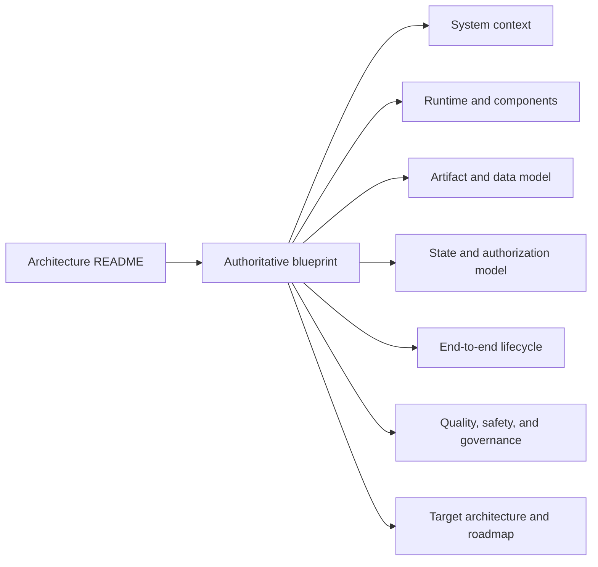

# FreeCAD Automation architecture

This directory is the single navigation entry point for the authoritative system blueprint. The blueprint describes the repository at baseline `f533ff9349d03bcee3de778c7886150c51acf5d2` and the intended path to the first genuine production proof without turning the product into a cloud service or allowing software artifacts to impersonate real-world authority.

## Start here

1. [Authoritative blueprint](./freecad-automation-blueprint.md) — system definition, invariants, current/target summary, status, and known discrepancies.
2. [System context](./system-context.md) — users, external actors, trust zones, and the boundary between the local product and production operations.
3. [Runtime and components](./runtime-and-components.md) — CLI, Studio, Local API, tracked jobs, Node/Python services, and the FreeCAD runtime.
4. [Artifact and data model](./artifact-and-data-model.md) — canonical, derived, private, temporary, immutable, and external artifacts plus lineage rules.
5. [State and authorization model](./state-and-authorization-model.md) — independent software and real-world state machines and human gates A–D.
6. [End-to-end lifecycle](./end-to-end-lifecycle.md) — current local workflows and the full controlled lifecycle through genuine evidence and release publication.
7. [Quality, safety, and governance](./quality-safety-and-governance.md) — verification lanes, fail-closed controls, claim policy, and architecture governance.
8. [Target architecture and roadmap](./target-architecture-and-roadmap.md) — additive evolution and exit criteria through the first production proof.

## Authority and evidence policy

This document set is an architectural index and synthesis, not a new runtime contract. When sources differ, use this precedence:

1. implementation and checked-in canonical artifact bytes;
2. schemas and machine-readable manifests;
3. contract, acceptance, integration, browser, and runtime tests;
4. CI workflows and executable command manifests;
5. descriptive documentation and historical execution plans.

Each important claim in this set has an `Evidence:` block naming repository paths and, where useful, exported symbols, commands, schemas, tests, or canonical artifacts. A discrepancy is recorded rather than resolved in favor of a more convenient description. This architecture task changes no runtime, evidence, readiness, procurement, manufacturing, publication, or deployment state.

Evidence:

- `AGENTS.md`
- `README.md`
- `src/shared/command-manifest.js` — `getCommandManifest`
- `tests/source-of-truth-drift.test.js`
- `tests/command-manifest.test.js`
- `docs/examples/example-library-manifest.json`
