# Artifact and data model

[Back to architecture navigation](./README.md)

## Artifact-first architecture

The durable product contract is a graph of versioned files, hashes, schemas, provenance, and human decisions. Processes are replaceable producers and consumers of that graph. Canonical machine truth is JSON unless a contract explicitly identifies source bytes—such as TOML configuration, CAD, CSV inspection results, or an externally held record—as authoritative input.

```mermaid
flowchart LR
  INPUT["Config / CAD / declared context"] --> MODEL["CAD and drawing outputs"]
  MODEL --> QA["Create, drawing, DFM, analysis artifacts"]
  QA --> REVIEW["review_pack.json"]
  REVIEW --> READY["readiness_report.json"]
  REVIEW --> REV["revision_impact_report.json"]
  REV --> PLAN["inspection_plan.json"]
  PLAN --> REL["inspection plan release record"]
  REL --> RESULT["genuine source bytes + normalization"]
  RESULT --> ONBOARD["candidate envelope + onboarding ledger"]
  ONBOARD --> AUTH["attachment authorization"]
  AUTH --> ATTACH["canonical evidence + immutable receipt"]
  ATTACH --> RCTX["attachment-bound review context"]
  RCTX --> RAUTH["readiness regeneration authorization"]
  RAUTH --> READY2["replacement readiness report"]
  READY2 --> BUNDLE["standard docs / release bundle"]
```

Evidence:

- `schemas/review_pack.schema.json`
- `schemas/readiness_report.schema.json`
- `schemas/revision_impact_report.schema.json`
- `schemas/inspection_plan.schema.json`
- `docs/inspection-evidence-contract.md`

## Artifact classes

| Class | Examples | Authority and retention |
| --- | --- | --- |
| Authoritative source | TOML config, imported CAD, genuine supplier/lab/QA result bytes, human authorization | Preserve exact bytes and hash; source authenticity still requires human/provenance review |
| Canonical machine artifact | Review pack, readiness report, revision impact report, inspection plan, evidence envelope | Schema-versioned JSON; preferred input for downstream automation |
| Derived presentation/transport | Markdown, PDF, CSV checksheet, SVG, ZIP, thumbnails | Regenerable view; cannot overrule its canonical JSON/source |
| Execution/provenance | Runtime fingerprint, artifact manifest, output manifest, job request/state/log | Explains how and where an output was produced; not engineering approval |
| Control/authorization | RFQ Gate A authorization, plan release authorization/record, evidence authorization, readiness authorization | Narrow scope, named human, exact bindings; never reusable for another gate |
| Immutable receipt | Inspection-plan release record, evidence attachment record | Create-only audit proof of a completed controlled write/release step |
| Private intake | Inbox source, quarantine snapshot, submission metadata | Ignored/local or external controlled store; never publish automatically |
| Temporary/scratch | Studio previews, transient import/bootstrap directories | Disposable and non-canonical |
| Fixture/demo | Test fixtures, synthetic envelopes, example inputs | Proves software behavior only; rejected as genuine production evidence |
| External reference | Quotation, purchase record, shipping record, inspector/lab system record | Held by its authority; refer by stable ID/hash when needed, do not fabricate locally |

Evidence:

- `src/shared/artifact-surface.js`
- `lib/artifact-manifest.js`
- `lib/output-manifest.js`
- `docs/stage-5b-artifact-schema-catalog.md`
- `tests/inspection-evidence-onboarding.test.js`

## Identity model

An artifact is not adequately identified by filename. Cross-boundary identity consists of:

- `package_slug` or equivalent stable package identifier;
- explicit part/model identity;
- explicit revision, with `null` treated as unknown rather than silently promoted;
- artifact type and schema version;
- byte-level SHA-256 and size where a handoff or authorization depends on exact content;
- generator/runtime provenance where the execution environment matters;
- stable feature, characteristic, plan-item, change, or finding IDs for semantic linkage;
- timestamps and named human identity references for scoped decisions;
- source and parent references sufficient to traverse lineage.

Path equality is not content identity. A regenerated file at the same path needs a new hash and must invalidate any authorization bound to the old bytes. Likewise, matching part names without authoritative revision identity are insufficient for evidence attachment.

Evidence:

- `lib/af-execution-contract.js`
- `src/services/revision-impact/revision-impact-service.js`
- `schemas/inspection-plan-release-authorization.schema.json`
- `schemas/inspection-evidence-authorization.schema.json`
- `src/services/inspection-evidence-intake/inspection-evidence-onboarding-service.js` — `readAuthoritativeCanonicalPackageRevision`

## Manifest contracts

The two manifest systems are complementary and must remain distinct.

| Contract | Scope | Key role | Non-role |
| --- | --- | --- | --- |
| `artifact-manifest` | CLI, API, sweep, and tracked-job artifact surfaces | Enumerates registered artifacts with interface, provenance, scope, stability, and presentation policy | It is not a complete run ledger and does not grant publication authority |
| `output-manifest` | Additive output tracking for major commands such as create/draw/DFM/FEM/tolerance/report/inspect | Records run metadata, timing, runtime/repository context, outputs, and linked artifacts | It does not replace artifact-manifest or legacy outputs |

Job-store control files other than `artifact-manifest.json` are internal execution state, not public artifacts. Browser access is based on registered paths and policy, not the mere existence of a file in the job directory.

Evidence:

- `schemas/artifact-manifest.schema.json`
- `schemas/output-manifest.schema.json`
- `docs/output-contract.md`
- `docs/output-manifest.md`
- `src/server/local-api-artifacts.js`

## Canonical package shape

The checked-in packages under `docs/examples/<slug>/` combine a selected configuration, generated/reviewed outputs, manifests, review/readiness artifacts, standard-document drafts, runtime provenance, and release packaging. `docs/examples/example-library-manifest.json` is the library index and records package classification and key artifacts. The package directory is a curated repository surface—not the default destination of every command.

The baseline has five canonical packages:

| Package | Config revision | Review/readiness revision | Readiness status | Gate |
| --- | ---: | ---: | --- | --- |
| `quality-pass-bracket` | unknown | unknown | `needs_more_evidence` | `hold_for_evidence_completion` |
| `plate-with-holes` | `A` | unknown | `needs_more_evidence` | `hold_for_evidence_completion` |
| `motor-mount` | `A` in curated config | unknown | `needs_more_evidence` | `hold_for_evidence_completion` |
| `controller-housing-eol` | `C` | unknown | `needs_more_evidence` | `hold_for_evidence_completion` |
| `hinge-block` | `A` | unknown | `needs_more_evidence` | `hold_for_evidence_completion` |

This mismatch is a first-proof blocker, not permission to copy a revision string into downstream JSON. The affected artifacts must be regenerated through the normal workflow from an authoritative source, then their descendants and hashes reviewed.

Evidence:

- `docs/examples/example-library-manifest.json`
- `docs/examples/*/config.toml`
- `docs/examples/*/review/review_pack.json`
- `docs/examples/*/readiness/readiness_report.json`
- `tests/canonical-package-integrity.test.js`

## Lineage and re-entry

Artifact re-entry allows a later workstation/session to continue without recreating live CAD work. It is safe only if the consumer validates:

1. schema and artifact type;
2. supported schema/contract versions;
3. package, part, and revision compatibility;
4. referenced file existence and SHA-256 where required;
5. producer/consumer compatibility markers;
6. absence of a weaker artifact presented as a stronger one.

The AF execution contract defines review pack, readiness report, and release-bundle re-entry targets. It also normalizes execution states across surfaces. Re-entry is continuity, not retroactive evidence: an artifact-only continuation cannot claim a FreeCAD run it did not perform.

Evidence:

- `lib/af-execution-contract.js`
- `src/services/jobs/af-reentry.js`
- `tests/af-execution-contract.test.js`
- `tests/example-library-studio-reopen.test.js`

## Inspection data separation

Inspection has four materially different data layers:

| Layer | Meaning | Maximum authority |
| --- | --- | --- |
| Plan and derived controls | What should be measured, how, and against which limits | `ready_for_human_release`; no measurement exists |
| Released plan record | Human authorization to execute one exact plan and exact distributed files | `released_for_inspection_execution`; not product release |
| Source result and normalization | What a source reported plus independently computed reconciliation | `ready_for_quarantine_review`; still an untrusted candidate |
| Attached evidence and receipt | Human-authorized canonical evidence plus immutable record of the write | Eligible input to later readiness regeneration; not readiness itself |

The normalizer retains reported and computed results separately. It must not make an inconsistent supplier result disappear by replacing it with a local calculation. Unsupported formats and units remain blocked or review-required.

Evidence:

- `schemas/inspection_plan.schema.json`
- `schemas/inspection-plan-release-record.schema.json`
- `schemas/inspection_result_normalization.schema.json`
- `schemas/inspection-evidence-attachment-record.schema.json`

## Write policy

Normal commands write to caller-selected output directories or server-selected job directories. Canonical-package mutation is exceptional and requires a dedicated service with allowlisted paths, clean/expected repository state, exact-byte authorization, and create-only or explicitly replacement-authorized semantics.

Evidence attachment creates the canonical evidence files and immutable receipt but leaves readiness hashes and bytes unchanged. Readiness regeneration is a second operation with a second authorization bound to the attachment-aware review context and exact current/replacement readiness hashes. This split makes it possible to audit whether evidence was attached without silently changing the release conclusion.

Evidence:

- `src/services/inspection-evidence-intake/stage5b-evidence-attachment-controller-service.js`
- `schemas/inspection-evidence-attachment-record.schema.json`
- `schemas/inspection-evidence-readiness-authorization.schema.json`
- `tests/readiness-inspection-evidence-contract.test.js`

## Retention and publication

- Canonical repository artifacts are versioned and reviewed through Git.
- Tracked jobs are local operational records; their retention is operator policy, not evidence policy.
- Preview scratch data is disposable.
- Private genuine source bytes remain in ignored quarantine or an authorized external record system until a controlled canonical transform is approved.
- Hosted/runtime CI artifacts are temporary diagnostics.
- Release bundles are local assemblies until a human separately authorizes a publication/delivery channel.

No architecture component may downgrade a private, temporary, or generated artifact into a public/canonical artifact based only on path placement. `src/shared/artifact-surface.js` centralizes artifact presentation and applies publication downgrades outside recognized roots.

Evidence:

- `src/shared/artifact-surface.js`
- `.gitignore`
- `.github/workflows/freecad-runtime-smoke.yml`
- `docs/ci-governance.md`
