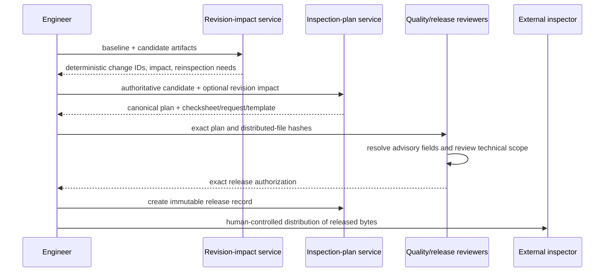
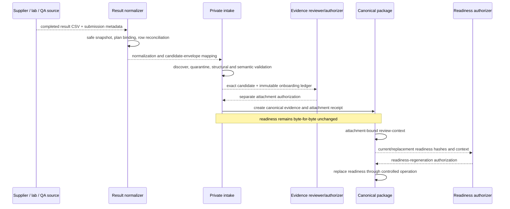

# End-to-end lifecycle

[Back to architecture navigation](./README.md)

## Lifecycle overview

The end-to-end system has three phases: local engineering, human-controlled production, and controlled evidence/release closure. Only the first and parts of the third are executable software workflows.

```mermaid
flowchart LR
  subgraph L["1 — Local engineering"]
    INTENT["Config / CAD / context"] --> GEN["Create, draw, inspect, analyze"]
    GEN --> REVIEW["Review pack and readiness"]
    REVIEW --> CHANGE["Revision impact and inspection plan"]
  end
  subgraph R["2 — Real-world production"]
    OUTREACH["Outreach"] --> SOURCE["Quote / provider / procurement"]
    SOURCE --> TECH["Technical release"]
    TECH --> MAKE["Manufacture"]
    MAKE --> MEASURE["Independent inspection"]
  end
  subgraph C["3 — Controlled closure"]
    RECEIVE["Receive genuine result bytes"] --> NORMALIZE["Normalize and reconcile"]
    NORMALIZE --> QUAR["Quarantine, validate, review"]
    QUAR --> ATTACH["Authorize and attach"]
    ATTACH --> REGEN["Authorize and regenerate readiness"]
    REGEN --> PUBLISH["Human release/publication"]
  end
  CHANGE -. "human-released technical bytes" .-> OUTREACH
  MEASURE -. "source bytes and provenance" .-> RECEIVE
```

## Current local engineering paths

### Config-led creation

1. Validate TOML and runtime assumptions.
2. Run `create` through FreeCAD to produce the native model and neutral/mesh exports.
3. Run additive round-trip quality checks and write output/run provenance.
4. Run `draw` to create TechDraw/SVG/PDF/PNG and drawing-quality artifacts.
5. Run `inspect`, DFM, tolerance/FEM/reporting, or planning commands as required.
6. Build a review pack from canonical inputs and explicit context.
7. Build readiness, standard-document drafts, and a release bundle.

Default quality behavior is warning-oriented where contracts say so; explicit strict modes may fail a command. Runtime-backed geometry claims require an actual runtime run.

Evidence:

- `bin/fcad.js`
- `lib/runner.js`
- `src/workflows/readiness-report-workflow.js`
- `src/workflows/release-bundle-workflow.js`
- `docs/product-workflows.md`

### Existing-CAD review

1. Ingest an existing CAD file and declared metadata.
2. Use FreeCAD-backed inspection when available; otherwise retain a clearly labeled metadata-only fallback.
3. Link geometry and quality facts into manufacturing decisions.
4. Produce `review_pack.json` as the canonical review handoff.
5. Continue readiness and packaging artifact-only, provided lineage validates.

The review-context pipeline does not make missing geometry facts disappear. It carries warnings, confidence, and provenance so a later consumer can distinguish observed geometry from declared metadata.

Evidence:

- `src/orchestration/review-context-pipeline.js`
- `scripts/ingest_context.py`
- `scripts/analyze_part.py`
- `scripts/quality_link.py`
- `scripts/reporting/review_pack.py`

### Studio interaction

1. `fcad serve` starts the loopback server and Studio.
2. Model/drawing/config changes may use temporary previews for rapid feedback.
3. Durable work is submitted as a tracked job.
4. The browser polls job state and reads only registered artifacts.
5. Review, Packs, Model, and Drawing workspaces reopen canonical or tracked artifacts without changing their authority.

Preview success is not job completion, and job completion is not canonical curation. Human selection remains necessary before outputs enter checked-in example packages or leave the workstation.

Evidence:

- `public/js/studio/studio-surfaces.js`
- `src/server/local-api-server.js`
- `src/server/studio-job-bridge.js`
- `src/services/jobs/job-executor.js`
- `tests/studio-shell-browser-smoke.test.js`

## Revision-to-inspection path

Full plans cover all selected inspection requirements. Delta plans select revision-affected items but remain human-review-required because omission risk is consequential. Missing package revision, stable characteristic identity, authoritative limits, compatible units, or conflict resolution can block release.

Evidence:

- `docs/revision-impact-and-reinspection.md`
- `docs/inspection-plan-and-supplier-checksheet.md`
- `tests/revision-impact-fixture-matrix.test.js`
- `tests/inspection-plan-adversarial.test.js`

## Current result-to-evidence path

The only closed result adapter is `plan-result-csv-v1@1.0`. It requires released-template lineage, exact source snapshot/hash, plan/package/revision binding, inspector/reviewer references, timestamps, method/equipment fields, and separate reported/computed results. Supporting a new format is a versioned adapter change, not a heuristic parser expansion.

Evidence:

- `docs/inspection-result-adapters.md`
- `src/services/inspection-result/inspection-result-normalization-service.js`
- `docs/inspection-evidence-contract.md`
- `tests/inspection-result-normalization.test.js`
- `tests/inspection-evidence-onboarding.test.js`

## First genuine production proof runbook

This is the target operational sequence. Steps marked **software** may be executed by this repository; steps marked **human/external** require the named authority and must not be automated by inference.

1. **Human + software — select one bounded package.** Choose a modest part and document why it is safe and representative. Preserve the selected baseline commit and workstation/runtime fingerprint.
2. **Human + software — establish identity.** Set the authoritative part number/package slug/revision in the source config; regenerate review/readiness/plan descendants; verify no `revision: null` remains in the proof chain.
3. **Software — establish engineering package lineage.** Run the necessary FreeCAD-backed and artifact-driven checks. Resolve blocking plan fields. Record exact hashes for the model, drawing, specifications, review pack, readiness report, plan, checksheet, request, and result template.
4. **Human — Gate A.** Approve exact non-binding outreach bytes, recipients, sender/channel, and confidentiality. Dispatch outside the product. Preserve message/response references externally.
5. **Human — Gate B.** Compare actual quotations; select provider; approve budget, terms, tax/shipping/payment, and purchase. Reference the external decision/transaction IDs and hashes in the proof record.
6. **Human — Gate C.** Engineering and quality reviewers approve exact manufacturing and inspection bytes, including tolerances, methods, material, finish, deburr, quantity/sampling, and revision. Create the existing inspection-plan release record. Distribute only released bytes.
7. **External — manufacture.** Supplier makes the real part under the selected order and revision. Retain supplier/lot/shipping records under their real custodian.
8. **External — inspect.** A sufficiently independent supplier/lab/QA role measures the physical part against the released plan and returns the native completed result plus identity, equipment/method, timestamps, disposition, and provenance.
9. **Software — normalize without promotion.** Snapshot the returned bytes, run the closed adapter, compare reported and computed outcomes, and stop at blocked/review-required/quarantine-review state as warranted.
10. **Human + software — Gate D attachment.** Quarantine; validate; review source authenticity and semantic consistency; issue a separate exact-byte attachment authorization; create canonical evidence and immutable receipt. Confirm readiness did not change.
11. **Human + software — readiness regeneration.** Produce attachment-bound review context, review the proposed replacement, issue separate authorization, and regenerate. A failed inspection remains a hold and still counts as a valid architectural proof.
12. **Human — product release/publication.** Review the final package and disposition. Approve any delivery or publication separately. Record the channel and immutable release reference; do not equate a local ZIP with publication.

## Completion evidence

The first proof is complete when a reviewer can traverse one unbroken chain from authoritative intent to physical result and back to canonical readiness without relying on filenames or narrative alone. At minimum, the chain needs:

- baseline commit, package slug, part identity, and non-null revision;
- runtime fingerprint and exact engineering-artifact hashes;
- Gate A record plus external dispatch/response references;
- Gate B selection/procurement references;
- Gate C technical and inspection release references;
- manufacturing lot/part and independent inspection-source references;
- original genuine result bytes and submission metadata;
- normalization, quarantine/onboarding ledger, attachment authorization, canonical evidence, and immutable receipt;
- pre-attachment readiness hash proving no side-effect mutation;
- attachment-bound review context, readiness authorization, replacement readiness hash, and truthful gate outcome;
- separate final release/publication decision or an explicit hold.

The repository should store only records permitted by confidentiality and privacy policy. External records may remain in their authoritative system and be represented by stable, non-secret references and hashes.

## Failure and recovery

| Failure | Correct response |
| --- | --- |
| FreeCAD unavailable | Continue only artifact-supported work; label fallback; do not claim runtime geometry validation |
| Job interrupted | Preserve failed/cancelled state and logs; retry only with unchanged, available inputs |
| Revision/identity mismatch | Stop plan release, normalization, or attachment; repair authoritative lineage and regenerate |
| Supplier format unsupported | Preserve source bytes; request the released template or add a reviewed versioned adapter later |
| Reported/computed mismatch | Keep both values; require quality review; do not silently “correct” the source |
| Evidence candidate rejected | Preserve audit state; corrected bytes start with a new identity |
| Hash changes after authorization | Invalidate authorization and obtain a new exact-byte decision |
| Inspection failure | Attach only if evidence is authentic and authorized; regenerate readiness to a truthful hold/disposition |
| Publication not approved | Keep the release bundle local and mark the process held |
