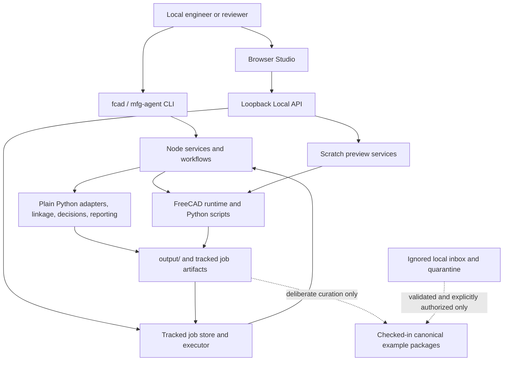

# Authoritative FreeCAD Automation system blueprint

## Document control

| Field | Value |
| --- | --- |
| Repository | `dooosp/freecad-automation` |
| Reference baseline | `f533ff9349d03bcee3de778c7886150c51acf5d2` |
| Package version | `1.1.0` |
| Architecture style | Local-first modular monolith with Node orchestration, Python analysis, and an optional local FreeCAD runtime |
| Primary navigation | [Architecture README](./README.md) |
| Scope of this blueprint | Current repository-controlled product plus the controlled real-world lifecycle through first genuine production proof |

This blueprint is the primary technical reference for the product as a whole. The supporting documents contain the detailed component, artifact, state, lifecycle, governance, and roadmap views.

## Executive definition

FreeCAD Automation is a local engineering-review and manufacturing-readiness toolchain. It accepts versioned configuration, existing CAD, and explicit engineering context; uses FreeCAD where live CAD generation or interrogation is required; produces traceable machine-readable artifacts; and lets people continue artifact-only workflows through a CLI, a loopback Local API, tracked jobs, and a browser Studio.

The product supports—but does not autonomously perform—commercial outreach, procurement, technical release, manufacturing, physical inspection, evidence approval, or release publication. Its strongest safety property is the refusal to treat generated analysis, a readiness score, a release bundle, a plan, a blank template, CI output, or a synthetic fixture as proof that a physical part exists or passed inspection.

Evidence:

- `README.md`
- `docs/vision.md`
- `docs/product-workflows.md`
- `package.json`
- `src/shared/command-manifest.js`
- `docs/inspection-evidence-contract.md`
- `tests/local-first-v1-acceptance.test.js`

## Two related systems

```mermaid
flowchart LR
  subgraph A["System A — local-first software product"]
    UI["Studio / CLI"] --> ORCH["Local API, job executor, Node orchestration"]
    ORCH --> RT["FreeCAD-backed execution"]
    ORCH --> ART["Artifact-driven analysis and continuation"]
    RT --> JSON["Canonical JSON and generated CAD/drawing artifacts"]
    ART --> JSON
    JSON --> GATES["Review, plan, normalization, evidence-control gates"]
  end

  subgraph B["System B — controlled real-world production lifecycle"]
    RFQ["RFQ outreach and quotations"] --> BUY["Vendor selection and procurement"]
    BUY --> REL["Technical release"]
    REL --> MAKE["Manufacturing"]
    MAKE --> INSPECT["Independent physical inspection"]
    INSPECT --> RECEIVE["Genuine result receipt"]
    RECEIVE --> PUBLISH["Authorized evidence/readiness and release publication"]
  end

  GATES -. "human-scoped requests and exact artifact hashes" .-> RFQ
  INSPECT -. "genuine source bytes and provenance" .-> GATES
  GATES -. "authorized package only; never automatic" .-> PUBLISH
```

System A ends at locally executed software, repository contracts, local private stores, canonical package mutations explicitly authorized by a human, and locally generated packages. System B begins whenever a person or organization contacts a supplier, commits funds, releases technical work, creates a physical part, measures it, approves evidence, or publishes a release. Software may record exact decisions at the boundary; it does not own the real-world act.

Evidence:

- `docs/preliminary-rfq-outreach-authorization.md`
- `schemas/preliminary-rfq-outreach-authorization.schema.json`
- `docs/inspection-plan-and-supplier-checksheet.md`
- `schemas/inspection-plan-release-record.schema.json`
- `docs/inspection-evidence-contract.md`
- `schemas/inspection-evidence-attachment-record.schema.json`
- `docs/ci-governance.md`

## Users and responsibilities

| Actor | Uses System A for | Retains authority for |
| --- | --- | --- |
| Design/CAD engineer | Config validation, model/drawing generation, import bootstrap, revision comparison | Design intent and technical correctness |
| Manufacturing engineer | DFM, process/line planning, review priorities, standard-document drafts | Process feasibility and released manufacturing instructions |
| Quality/inspection engineer | Inspection requirements, inspection plans, result reconciliation, evidence review | Measurement method, disposition, evidence review, and quality approval |
| Maintainer/operator | Runtime diagnostics, local server, jobs, audits, doctors, package/release preparation | Environment custody, controlled writes, publication, and recovery |
| Procurement/commercial authority | Reads bounded RFQ material and quotations | Vendor choice, budget, purchase, payment, shipping, and commercial commitment |
| Supplier/lab/independent inspector | Receives human-released control material and returns completed records | Manufacturing and measurement acts, source record authenticity, and provenance |
| Release authority | Reviews exact hashes and readiness state | Technical release, evidence attachment authorization, readiness regeneration, and publication |

No actor can delegate a real-world decision to a generated artifact merely because that artifact is schema-valid.

Evidence:

- `docs/vision.md`
- `src/shared/command-manifest.js` — command `audience` and `safetyBoundary` metadata
- `docs/preliminary-rfq-outreach-authorization.md`
- `docs/inspection-result-adapters.md`
- `docs/inspection-evidence-contract.md`

## Architectural invariants

1. **Local first.** `fcad serve` binds to `127.0.0.1`; files and tracked jobs remain local unless a separately authorized human action moves them.
2. **One product, two execution classes.** FreeCAD-backed operations and artifact-driven operations share orchestration and artifacts but never share an implied runtime requirement.
3. **JSON before presentation.** Canonical JSON is the machine source of truth; Markdown, CSV, PDF, SVG, and ZIP are derived or transport views unless an explicit contract says otherwise.
4. **Lineage before re-entry.** Review pack, readiness report, and release-bundle continuation must preserve schema, source refs, compatibility markers, and part lineage.
5. **Generated review evidence is not inspection evidence.** CAD, TechDraw, create/drawing QA, DFM, reports, plans, templates, diagnostics, and CI output can guide review but cannot satisfy `inspection_evidence`.
6. **Every real-world gate is human-scoped and hash-bound.** Outreach, plan release, evidence attachment, readiness regeneration, procurement, technical release, and publication are separate decisions.
7. **State machines stay independent.** Job success, QA pass, readiness status, plan status, normalization status, evidence lifecycle, manufacturing state, and publication state must never be collapsed into one “ready” flag.
8. **Fail closed on identity or authority gaps.** Unknown revision, stale checksum, unsupported unit/format, missing reviewer, path escape, or inconsistent binding remains blocked or review-required.
9. **No cloud or microservice redesign.** Evolution stays additive within the local modular monolith until a proven requirement justifies otherwise.

Evidence:

- `src/server/local-api-server.js` — `startLocalApiServer`
- `lib/runner.js` — `runScript`
- `lib/af-execution-contract.js`
- `schemas/review_pack.schema.json`
- `schemas/readiness_report.schema.json`
- `src/services/inspection-evidence-intake/inspection-evidence-onboarding-service.js`
- `tests/readiness-inspection-evidence-contract.test.js`
- `.github/workflows/freecad-runtime-smoke.yml`

## Current product architecture

The CLI is the complete operational surface. Studio is the preferred review console and exposes five workspaces—Console, Review, Packs, Model, and Drawing—through a lightweight English/Korean locale layer. The Local API provides scratch preview routes and persistent tracked-job routes. Tracked jobs persist request, state, logs, result, and artifact manifest under `output/jobs/<job-id>/`; browser responses redact raw paths and expose only registered, policy-eligible artifacts.

FreeCAD-backed commands call `lib/runner.js`, which spawns the resolved FreeCAD executable, sends UTF-8 JSON on stdin, and extracts a JSON response from stdout. Artifact-driven services continue from existing JSON and file hashes without launching FreeCAD. The analysis stack remains additive: adapters → geometry → linkage → decision → reporting.

Evidence:

- `bin/fcad.js`
- `public/js/studio/studio-surfaces.js`
- `public/js/i18n/index.js`
- `src/server/local-api-server.js`
- `src/services/jobs/job-store.js`
- `src/services/jobs/job-executor.js`
- `lib/runner.js`
- `docs/architecture-v2.md`

## Current versus target

| Concern | Implemented now | Target through first genuine production proof |
| --- | --- | --- |
| CAD runtime | Local FreeCAD discovery and JSON-over-stdin wrappers; self-hosted macOS runtime smoke | Preserve; pin the exact runtime fingerprint used for the proof |
| Product surfaces | CLI, Studio, loopback API, previews, tracked jobs, artifact re-entry | Preserve; improve proof-specific guidance, not distribution |
| Engineering artifacts | Config, CAD exports, TechDraw, QA, DFM, review pack, readiness, standard docs, release bundle | Preserve canonical JSON and hash lineage end to end |
| Revision/change | Deterministic artifact-driven revision impact and reinspection planning | Resolve package revision propagation before evidence attachment |
| Inspection planning | Canonical full/delta plan plus derived control files; human release record | Use one human-released plan bound to exact distributed bytes |
| Result receipt | One closed `plan-result-csv-v1@1.0` normalizer; maximum `ready_for_quarantine_review` | Normalize one genuine completed result without widening formats |
| Evidence onboarding | Quarantine, validate, authorize, attach, immutable receipt, separate readiness authorization | Exercise once with genuine private source bytes and real human identities |
| RFQ/procurement | Hash-bound Gate A authorization record only; no dispatcher; B/C external | Conduct outreach, quotation, procurement, and technical release as human operations with exact bindings |
| Manufacturing/inspection | Outside software; no claim of completion | Produce and independently inspect one real part |
| Readiness/publication | All canonical packages held; local release bundles exist; publication is human | Regenerate readiness only after attachment; publish only after human release review |

Evidence:

- `src/shared/command-manifest.js`
- `src/services/revision-impact/revision-impact-service.js`
- `src/services/inspection-plan/inspection-plan-service.js`
- `src/services/inspection-result/inspection-result-normalization-service.js`
- `src/services/inspection-evidence-intake/inspection-evidence-onboarding-service.js`
- `src/services/preliminary-rfq-outreach/preliminary-rfq-outreach-authorization-service.js`
- `docs/examples/example-library-manifest.json`

## Current truth at the reference baseline

- Five checked-in packages are classified as canonical: `quality-pass-bracket`, `plate-with-holes`, `motor-mount`, `controller-housing-eol`, and `hinge-block`.
- Their readiness scores are 61, 61, 55, 52, and 52 respectively.
- Every package is `needs_more_evidence` with `hold_for_evidence_completion` because genuine `inspection_evidence` is missing.
- Release bundles are curated review/transport artifacts, not release publication and not proof of manufacture or inspection.
- The repository contains software contracts and synthetic rejection/acceptance fixtures, but no genuine completed physical/supplier/lab/QA inspection record attached to a canonical package.

Evidence:

- `docs/examples/example-library-manifest.json`
- `docs/examples/*/readiness/readiness_report.json`
- `docs/project-closeout-status.md`
- `tests/canonical-package-integrity.test.js`
- `tests/local-first-v1-acceptance.test.js`

## Known discrepancies and architectural seams

| ID | Observation | Runtime source of truth | Architectural consequence |
| --- | --- | --- | --- |
| D-01 | `plate-with-holes`, `motor-mount`, `controller-housing-eol`, and `hinge-block` package configs declare revisions, but all five checked-in review packs and readiness reports carry `revision: null`; `quality-pass-bracket` has no configured revision. | Canonical artifact bytes and `readAuthoritativeCanonicalPackageRevision()` control evidence attachment. | First production proof must repair and regenerate revision lineage; attachment must fail closed until identity is authoritative. |
| D-02 | `docs/architecture-v2.md` accurately describes the analysis layers but predates Studio, Local API, jobs, revision/inspection, and evidence-control architecture. | Current implementation, schemas, command manifest, and tests. | Treat Architecture V2 as a layer view, not the complete system context; this blueprint supersedes it as navigation. |
| D-03 | AF lifecycle vocabulary is `canceled`, while the job store persists `cancelled`. | `normalizeAfExecutionState()` maps the persisted spelling through `AF_EXECUTION_STATE_ALIASES`. | Consumers must normalize through the AF contract rather than comparing raw strings across surfaces. |
| S-01 | `review-context` is not in the ordinary `STUDIO_JOB_COMMANDS` list, but the Studio submission bridge deliberately adds a constrained source-path handoff. | `STUDIO_SUBMISSION_JOB_COMMANDS` in `src/server/studio-job-bridge.js`. | Do not infer broad arbitrary-file import from generic Studio job metadata; the special bridge is narrower. |

Evidence:

- `docs/examples/*/config.toml`
- `docs/examples/*/review/review_pack.json`
- `docs/examples/*/readiness/readiness_report.json`
- `src/services/inspection-evidence-intake/inspection-evidence-onboarding-service.js` — `readAuthoritativeCanonicalPackageRevision`
- `lib/af-execution-contract.js`
- `src/server/studio-job-bridge.js`

## Definition of first genuine production proof

The first proof is not a green CI run, a quality-pass fixture, a readiness score, or a ZIP. It is one package-scoped chain in which:

1. authoritative part and revision identity are present in the config, review pack, readiness report, inspection plan, and external records;
2. a human approves any outreach, provider choice, procurement, technical release, and inspection execution separately;
3. a real part is manufactured outside the software;
4. an independent physical/supplier/lab/QA source completes the released inspection plan and returns genuine source bytes with provenance;
5. software normalizes, quarantines, and validates the bytes without promoting them automatically;
6. distinct human review and authorization bind the exact source, envelope, package, revision, and ledger hashes;
7. attachment creates the immutable receipt while leaving readiness unchanged;
8. attachment-bound `review-context` runs and a second authorization binds the exact readiness replacement;
9. readiness is regenerated truthfully—ready only if the evidence actually supports it, otherwise held;
10. standard documents, release packaging, and any publication occur only under separate human release authority.

The proof succeeds architecturally even if inspection discovers a nonconformance and readiness remains held: that demonstrates truthful state propagation. A claim that the part is accepted for production additionally requires a passing disposition and human release decision.

Evidence:

- `schemas/inspection-plan-release-record.schema.json`
- `schemas/inspection_result_normalization.schema.json`
- `schemas/inspection-evidence-envelope.schema.json`
- `schemas/inspection-evidence-attachment-record.schema.json`
- `schemas/inspection-evidence-readiness-authorization.schema.json`
- `docs/inspection-evidence-contract.md`
- `docs/ci-governance.md`

## Detailed views

- [System context](./system-context.md)
- [Runtime and components](./runtime-and-components.md)
- [Artifact and data model](./artifact-and-data-model.md)
- [State and authorization model](./state-and-authorization-model.md)
- [End-to-end lifecycle](./end-to-end-lifecycle.md)
- [Quality, safety, and governance](./quality-safety-and-governance.md)
- [Target architecture and roadmap](./target-architecture-and-roadmap.md)
