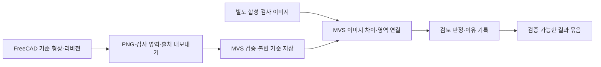

# FreeCAD–Manufacturing Vision Studio 품질보증 연동 설계

작성일: 2026-09-18. 현재 범위는 실행 계획과 설계 검토다. 이 문서의 새 기능은 아직 구현·검증되지 않았다.

## 1. 목표와 우선순위

**장착판 한 부품의 설계 기준, 이미지 검사 영역, 분석 결과, 검토 판정과 근거를 같은 부품·리비전으로 연결한다.** 첫 대상은 Coolgear 기준 장착판 R1의 상면과 구멍 8개다. FreeCAD는 검사 기준을 생산하고 Manufacturing Vision Studio(MVS)는 그 기준에 연결된 합성 검사 사례를 처리한다.

개발 순서는 기준 버전·현재 누락 확인 → 연결 데이터 계약 → 필요한 FreeCAD 내보내기와 MVS 검사 영역 전달 → 한 사례의 전체 흐름 검증 → 품질보증 포트폴리오다. 첫 코딩 대상은 MVS의 가져온 검사 영역이 실제 분석까지 전달되는지를 재현하는 계약 테스트다. FreeCAD의 첫 기능 추가는 이 계약을 만족하는 기준 자료 내보내기다.

사용자는 실물이 없으며 기준 설계로 진행한다고 확인했다. 합성 데이터와 디지털 검증으로 현재 범위를 완성한다. `physical_test=not_tested`, `manufacturing_release=false`, 하중 정격·토크 `null`을 유지한다.

## 2. 확인한 기반과 누락

| 대상 | 2026-09-18 관찰 | 적용 범위 |
|---|---|---|
| FreeCAD 브랜치 | `codex/usb-hub-reference-mount-v1`, `a4a1a3f696deaf260cc8b2879d98d9c2ffd0e8b8`, clean | 이번 계획의 입력 기준 |
| MVS 저장 경로의 HEAD | `codex/e1-declared-source-dataflow-redesign`, `3ced81cd94edf1f15f80ce140eab59a267867b17` | 현재 읽은 소스 기준; 통합용 적격 버전으로 승인한 것은 아님 |
| MVS 작업 트리 | `configs/evaluation/e1-v2-candidate-selection.json` 수정 존재 | 변경 내용을 보존하고 별도 clean 작업 트리 사용 |
| 별도 MVS 수리 기록 | `9020ea4cf0a7deadbb0b0558d0c3b6e2b9588d10`에서 `QA_ENTRY_HOLD` | 다른 작업 트리/커밋의 이력; 현재 HEAD의 새 시험 결과로 전용하지 않음 |
| FreeCAD 검증 이력 | 조립 목록 10검사, 39객체/89솔리드; 기존 도면 QA 91점/필수 치수 추적률 100% | 기준 설계의 디지털 근거 |
| MVS 가져오기 | JSON/PNG와 부품·CAD 리비전·파일 해시를 검증하는 `FreeCADExportAdapter` 존재 | 원본 CAD 파일 실행이나 원본 저장소 수정 없이 가져오기 |
| MVS 실제 검사 영역 | 가져온 `features`를 case에 저장하지 않고 기본 예제 영역을 사용 | **연동을 위해 구현해야 할 현재 누락** |

MVS에서 직접 확인한 경로는 다음과 같다.

- `src/manufacturing_vision_studio/adapters.py`: `import_reference()`는 검증한 PNG를 `registry.add_reference()`에 넘긴다. manifest의 검사 영역을 저장·분석에 연결하는 호출은 없다.
- `src/manufacturing_vision_studio/registry.py`: `_case_document()`는 `sorted(DEFAULT_FEATURE_REGIONS)`를 반환하고, `analyze_case()`는 `inspect(reference, inspection)`를 호출한다.
- `src/manufacturing_vision_studio/model.py`: `inspect(..., feature_regions=None)`는 외부 영역을 받을 수 있지만 생략하면 기본 예제 영역을 사용한다.
- `schemas/v1/inspection-case.schema.json`: 선택 항목 `freecad_adapter_binding`은 `export_id`, `manifest_sha256`을 정의하지만 현재 src에서는 사용되지 않는다.

따라서 importer의 존재와 Coolgear 8개 구멍의 완전한 연결은 서로 다른 상태다. 위 누락은 이번 계획에서 소스를 읽어 확인했다. 새로운 회귀 시험을 실행해 확인한 결과는 아니다.

## 3. 책임과 저장소 경계



- FreeCAD: 유효한 장착판 형상, 실제 읽은 구멍 중심·지름, 고정 뷰, 기준 PNG와 투영 근거를 생산한다.
- MVS: 받은 바이트·식별자·영역을 검증하고 복사하여 보존한다. 저장된 영역을 분석·표시·결과 내보내기·재가져오기에 연결한다.
- 품질보증 사례: 요구사항/검사 항목/근거/변경/재검토/시정조치의 연결을 설명한다.
- 저장소는 분리한다. MVS는 FreeCAD 원본을 읽기 전용으로 취급한다. MVS에서 STEP/FCStd/매크로를 실행하지 않는다.
- 현재 E1 재설계 작업 트리·평가 프로토콜·후보 선택·기존 결과를 변경하지 않는다. 기존 사용자 수정과 과거 압축 자료를 보존한다.
- 제품 간 자동 쓰기 반환, 배포, 생산 승인, 업체 메시지 전송을 추가하지 않는다.

## 4. 첫 연결 데이터 계약

### 4.1 식별과 바이트 연결

초기 제안 식별자는 `part_id=USB-REF-ADAPTER`, `cad_revision=R1`이다. 기존 파일명 `usb_hub_reference_adapter_R1`과의 대응을 명시하며 기존 원본 식별자를 덮어쓰지 않는다. 구멍 ID는 입력의 `hole_H1`–`hole_H4`, `hole_P1`–`hole_P4`를 그대로 쓴다.

기존 MVS `freecad-export-adapter-manifest` v1의 최상위 형식을 유지한다. 새 시스템용 manifest를 별도로 만들지 않는다. `feature_map`·`cad_metadata` JSON의 내용은 명시적으로 버전이 있는 `coolgear-plate-top/v1` 프로파일로 검증한다. 새 CAD-feature 연결 경로에서는 프로파일을 이해하지 못하면 기본 영역으로 대체하지 않고 거부한다. 기존 v1 아카이브 읽기와 새 CAD-feature 분석의 허용 조건을 구분한다.

배포 폴더에는 다음 네 파일을 제공한다.

```text
freecad-export-adapter-manifest.json
reference.png
feature-map.json
cad-metadata.json
```

manifest의 `features`와 `feature-map.json`의 정렬된 ID/영역이 정확히 같아야 한다. `cad-metadata.json`에는 원본 형상·입력·기존 출력 manifest의 SHA-256, 생산자 커밋, FreeCAD 버전, 부품·리비전, mm 단위, 뷰·좌표 변환·PNG 크기를 넣는다. `source_manifest_sha256`은 **실제로 읽은 기존 FreeCAD 출력 manifest 바이트**의 해시다. 새 adapter manifest 자신의 해시를 넣지 않는다.

원본 출력 manifest가 없거나, 그 manifest의 CAD 해시가 입력 CAD와 맞지 않으면 export를 중단한다. 원본 CAD를 포함하지 않는 MVS 묶음은 원본 CAD 재계산까지 독립 검증했다는 의미가 아니다. MVS가 검사하는 것은 전달된 바이트·식별·연결의 일관성이다.

G0/G1에서 사용자가 선택한 원본 커밋·입력·CAD·출력 manifest의 예상 해시와 생산 도구를 고정한 뒤 가져오기에서 대조한다. 임의 입력을 수정하고 모든 내부 해시를 다시 계산해도 그 예상 기준과 맞지 않으면 거부한다. 해시 자체가 출처 인증이나 전자서명인 것처럼 표현하지 않는다.

### 4.2 이미지 좌표

첫 프로파일은 장착판 상면의 직교 투영이다. CAD 원점은 좌측 하단, X 오른쪽/Y 위쪽, PNG는 좌측 상단, u 오른쪽/v 아래쪽이다. 142×74 mm 판에 양쪽 5 mm 여백을 주고 10 px/mm를 사용하여 1520×840 px로 고정한다. 이 수치는 렌더링 설계값이며 카메라 교정값이 아니다.

기준 PNG는 실제 native 형상에서 읽은 평면 외곽과 원형 관통공의 단색 silhouette다. 조명이나 사진 같은 외관을 합성하지 않는다. 첫 exporter는 이 평판 형상만 지원하고, 곡면·가려진 구멍·지원하지 않는 외곽은 명시적으로 실패시킨다. 단색 픽셀 배열과 PNG 인코딩은 표준 라이브러리로 구성할 수 있어 GUI 화면 캡처나 새 렌더링 서비스가 선행 조건이 아니다.

```text
u = 10 × (x + 5)
v = 10 × (79 − y)
normalized = (u / 1520, v / 840)
```

구멍의 CAD 반지름에 1 mm 문맥 여유를 더한 사각형을 ROI(검사 영역)로 사용한다. mm 공차나 합격 허용값으로 해석하지 않는다. 최소 3개의 비공선 기준점과 판 외곽을 별도 투영 검사로 확인한다. 이미지 미러링·90도 회전·크롭·크기 변경은 새 뷰 계약 없이 허용하지 않는다. 전체 조립 미리보기나 치수 문자가 있는 A3 도면 이미지를 검사 기준으로 쓰지 않는다.

이미지 정합은 검사 영상을 **기준 영상 좌표**로 옮긴다. ROI와 결과 마스크는 같은 기준 좌표계에 있어야 한다. 경계 밖 픽셀, 검출 영역 밖 이상, 가려짐은 각각 기록하고 임의로 가장 가까운 구멍에 연결하지 않는다.

ROI 픽셀 구간은 `[left, right) × [top, bottom)`으로 선언하고 부동소수점 정규화에서 픽셀 경계를 복원하는 규칙을 생산자·소비자 시험으로 고정한다. 판은 대칭 배치이므로 영상만으로 180도 방향이나 미러링을 항상 구분한다고 주장하지 않는다. 비대칭 계약 fixture로 변환 코드를 검사하고 실제 기준은 선언된 뷰·해시와 대조한다. 전체 평행이동과 구멍 하나의 이동을 따로 시험하여 정합이 결함을 흡수하는 실패도 기록한다.

첫 검사범위는 구멍 8개다. 별도 외곽 ROI가 없는 `edge-change`는 검출되어도 feature 연결에서는 미매핑/미검사 범위로 표시한다. 외곽 품질을 검사 완료로 확대하지 않는다.

### 4.3 불변 기준과 변경

MVS에 보존할 기준은 adapter manifest의 원본 바이트/해시, feature-map·metadata·reference PNG 바이트/해시, 정렬된 8개 ID/영역이다. 검증과 저장에 같은 입력 스냅샷을 사용한다. 잘못된 입력은 case revision·DB·blob을 부분 갱신하지 않는다.

새 CAD 연동 case는 `freecad_adapter_binding`을 실제로 출력한다. 기존 합성 case의 기본 영역과 기록은 유지한다. CAD 연동 case에서 binding이 없거나 손상되면 기본 예제로 되돌아가지 않는다.

영역·뷰·기준 PNG의 변경은 분석 입력 변경이다. 변경된 바이트와 설정을 새 case revision 또는 새 case에 결합하고 과거 분석·판정을 현재 결과로 재사용하지 않는다. 계산 설정 해시와 CAD 영역·뷰 binding 해시를 구분하여 모두 결과에서 검증한다. 기존 해시 필드의 의미를 조용히 바꾸지 않는다. 엄격한 스키마 확장이 필요하면 새 버전을 명시하고 기존 v1 읽기·검증을 유지한다.

## 5. 검증 상태와 기존 HOLD

기존 `QA_ENTRY_HOLD` 기록은 그대로 보존한다. 새 작업은 정확한 통합용 커밋에서 다음을 각각 기록한다.

| 상태 축 | 필요한 근거 |
|---|---|
| 기본 경로 검사 | 모델·case·검토 판정·파일 묶음·API·웹의 기존 관련 시험 |
| 연동 계약 검사 | 8개 영역 전달, 잘못된 연결 차단, 재가져오기·동일성 검증 |
| 저장소 전체 검사 | 해당 커밋에서 끝까지 완료한 `make validate` 등의 결과 |
| 고급 E1 연구 상태 | 해당 E1 커밋/프로토콜과 기존 HOLD 해소 여부 |
| 물리 적합성 | 현재 범위 밖, 계속 미검증 |

기본 경로/연동의 범위 내 통과가 저장소 전체 통과, E1 HOLD 해제, 일반 `DEMO_READY` 또는 `FIELD_READY`를 의미하지 않는다. 반대로 다른 커밋의 과거 실패만으로 새 exporter 작성 전체를 무기한 중단하지 않는다. 실제 선택 커밋에서 관련 의존 경로에 영향을 주는 실패는 재현·분류하고, 그 범위의 수리를 별도 작업으로 분리한다. 테스트 삭제·약화·선택 제외로 통과를 만들지 않는다.

## 6. 합성 평가와 품질보증 산출물

- 첫 데이터는 고정 seed의 정상, 누락 구멍, 이동 구멍, 외곽 변화, 제한된 영상 잡음 사례다. 결함 정답·생성 매개변수는 분석 모델에 전달하지 않는다.
- smoke/review 사례와 평가 사례를 사전에 나누고 데이터·라벨·모델·임계값을 고정한다. 새로운 사례를 보고 threshold를 바꾸면 별도 평가 버전으로 기록한다. 기존 E1의 threshold와 평가 결과는 수정하지 않는다.
- 결함 샘플을 만드는 변형 CAD는 생성 이력이다. R1 검사 대상인 결함 샘플의 기대 CAD revision은 R1로 유지한다. 정상 설계의 R2 변경과 별도의 revision 불일치 입력은 다른 시험 집합으로 둔다. 정답 오류를 고치면 dataset 버전을 올려 다시 평가한다.
- 결과에는 표본 수, 정상/이상 분류의 FP/FN, feature 연결의 정오·미매핑, 실행 실패·판정보류를 각각 기록한다. 놓친 사례도 결과에 남긴다.
- 영상 차이 검출은 실제 치수 공차 판정, 실제 결함률, 공정능력, 계측시스템 검증의 대체물이 아니다.
- R1/R2 각각의 권위 있는 입력·구성·render·case를 독립 생성한다. 기존 `compare-rev`와 `inspection-plan`으로 연결 가능한 부분은 기존 계약을 사용한다. 전용 결과를 canonical inspection evidence로 승격하지 않는다.
- 품질보증 자료는 요구사항–검사 항목–근거 연결표, 변경 영향/재검토 목록, 실제 발생한 소프트웨어 치수 추적 오류의 원인·수정·회귀 확인 사례, 1페이지 포트폴리오 요약이다.
- 자동 회귀 시험의 scripted disposition은 합성 시험 행위로 표시한다. 실제 검토자의 이름·승인·의견을 생성하지 않는다. 실제 검토가 없으면 그 상태를 그대로 남긴다.

## 7. 후순위

다른 장치 3종으로 범용화, 새로운 학습 모델, 대규모 Studio 개편, 클라우드/계정/과금, 카메라·PLC, 광학 치수 계측, 실제 하중·열 시험은 첫 관통 사례 이후 별도 목표로 다룬다. FreeCAD의 기존 master 통합 계획과 MVS 고급 E1 재설계 계획도 이 연동 계획의 자동 실행 항목으로 편입하지 않는다.

## 8. ChatGPT Pro 리뷰와 최종 판단

2026-09-18 기존 ChatGPT 대화에 계획과 위 소스 확인 내용을 보내고 **화면의 `6 Pro` 모드에서 리뷰 답변을 받았다.** 원문 요청/답변과 해시는 로컬 제어 기록에 보존한다. Pro는 저장소나 시험을 직접 실행하지 않았으며 제출한 사실을 전제로 설계 의견을 냈다. 아래는 실제 답변을 반영한 요약이다.

| 항목 | Codex 초안 | Pro 지적 | 종합 결정 |
|---|---|---|---|
| 우선순위 | 기준 고정·제한된 exporter·consumer 연결 | MVS feature 소실 재현과 계약부터 시작 | 첫 작업은 정확한 MVS SHA의 통합 착수 근거 보고서 |
| 좌표 | 상면·고정 뷰·8개 ROI | 정합 방향/경계와 결함 이동 흡수 반례 필요 | 비대칭 투영 시험, 전체 이동/개별 구멍 이동 분리 |
| 신뢰 기준 | source/artifact 해시 보존 | 재해시만으로 신뢰가 생기지 않음 | 선택한 upstream 예상값·도구·변환 설정 대조 |
| 평가 | 고정 seed·FP/FN·별도 데이터 | 변형군 단위 분리, 파일명/정답 누수 방지 | 평가용 동결 프로파일과 모델 입력 범위 검사 |
| revision | R1/R2 변경·재검토 | 승인된 설계 변경과 생성용 결함 CAD 혼동 방지 | 정상 기준 변경, R1 결함, 잘못된 revision을 별도 시험 |
| HOLD | 기존 E1와 core 검사 결과 분리 | 의존 영향 불명확성도 보류 사유 | 실제 의존 근거와 표적 검사로 관련성을 판정 |

제 판단은 첫 FreeCAD 기능 추가 범위를 좁게 유지하면서 **MVS의 검사 영역 전달·불변 보관·재가져오기까지**를 하나의 완료 목표로 잡는 것이다. PNG 가져오기 성공만으로 연결이 끝났다고 하지 않는다. 현재 포트폴리오 표현은 “연결 공백을 식별하고 통합 검증 계획을 수립”이며 실제 관통 시험 후에만 “8개 특징을 끝까지 연결·검증”으로 바꾼다. 이전 치수 추적률 0→100%도 동일 입력/검사항목/분모/전후 커밋 근거가 확인될 때만 개선 지표로 쓴다.

## 9. 참조

- [현재 기준 설계 자료](../usb-hub-reference-design-package.md)
- [현재 기준 구성](../reference-data/usb-hub-reference-baseline.json)
- [기존 변경 비교 흐름](../revision-impact-and-reinspection.md)
- [기존 검사 계획 흐름](../inspection-plan-and-supplier-checksheet.md)
- [연동 실행 계획](../exec-plans/freecad-mvs-qa-integration.md)
- MVS: `docs/architecture/system-architecture.md`, `docs/architecture/api-and-storage.md`, `AGENTS.md`, `schemas/v1/freecad-export-adapter-manifest.schema.json`.
