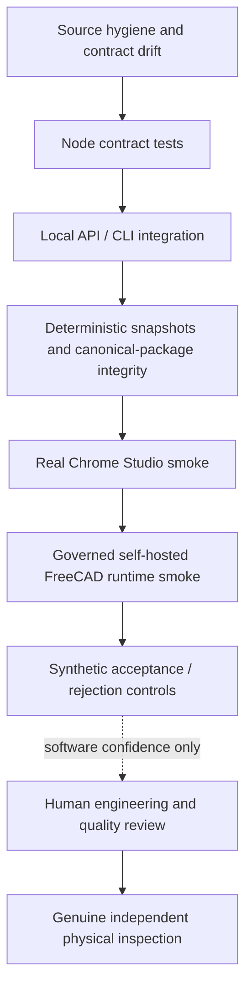

# Quality, safety, and governance

[Back to architecture navigation](./README.md)

## Assurance model

The repository uses layered evidence. A stronger lane may validate behavior that a weaker lane cannot, but no software lane proves a real physical act.

Evidence:

- `tests/lane-manifest.js`
- `.github/workflows/automation-ci.yml`
- `.github/workflows/freecad-runtime-smoke.yml`
- `tests/local-first-v1-acceptance.test.js`
- `docs/testing.md`

## Verification lanes

| Lane | Environment | Proves | Cannot prove |
| --- | --- | --- | --- |
| Source hygiene/drift | Hosted Node | Repository source policy and duplicated-source contracts remain aligned | Runtime behavior or engineering validity |
| Node contract | Ubuntu/macOS hosted | Schemas, services, CLI contracts, safety boundaries, artifact handling | FreeCAD execution or browser behavior |
| Integration | Hosted Node/Python | Cross-component Local API/CLI/job behavior | CAD runtime correctness |
| Snapshots | Hosted deterministic fixtures | Stable normalized presentation/outputs | Physical correctness |
| Studio browser smoke | Real Chrome/CDP, no FreeCAD required | Five Studio surfaces render and interact against controlled API behavior | FreeCAD-backed generation or external acts |
| Python | Hosted Python 3.11 | Plain Python adapters, analysis, linkage, decision/report logic | FreeCAD modules unless explicitly in runtime lane |
| Runtime smoke | Governed self-hosted macOS with FreeCAD | Runtime discovery and actual model/drawing/analysis/report/integration behavior | Supplier/manufacturing/inspection truth |
| Local-first v1 acceptance | Deterministic synthetic local scenario | End-to-end software rejection/acceptance boundaries and no forbidden canonical mutation | Genuine evidence, readiness release, or publication |

The executable lane manifest is the source of truth for test membership. Runtime smoke is gated behind hosted CI success, repository ownership checks, a protected environment, pinned checkout, temporary artifact upload, and cleanup.

Evidence:

- `tests/lane-manifest.js`
- `scripts/run-test-suite.js`
- `docs/ci-governance.md`
- `docs/self-hosted-runtime-governance.md`

## Safety claims and controls

| Hazard | Primary control | Verification evidence |
| --- | --- | --- |
| Public network exposure | API binds `127.0.0.1` only | `tests/local-api-server.test.js`, `tests/runtime-health-parity.test.js` |
| Arbitrary filesystem disclosure | Registered artifacts, allowed roots, path redaction, size-capped preview | `tests/studio-artifact-actions.test.js`, `tests/local-api-canonical-artifact-preview.test.js` |
| Client-chosen job output escape | Server-selected job directories and validated command schemas | `tests/af-execution-jobs.test.js`, `tests/studio-job-bridge.test.js` |
| Partial/corrupt durable JSON | Atomic temporary-write-and-rename behavior | `tests/revision-impact-output-safety.test.js`, `tests/inspection-plan-output-safety.test.js` |
| False runtime-backed claim | Runtime fingerprint, explicit fallback warnings, separate runtime lane | `tests/runtime-fingerprint.test.js`, `tests/report-runtime-fallback.test.js` |
| Generated artifact treated as evidence | Evidence classification and tracked-fixture fingerprints | `tests/inspection-evidence-onboarding.test.js`, `tests/stage5b-source-of-truth-guard.test.js` |
| Source result rewritten as local truth | Separate reported/computed fields and inconsistency status | `tests/inspection-result-normalization.test.js` |
| Stale/wrong-revision attachment | Exact package/revision/hash checks against canonical source | `tests/inspection-evidence-contract.test.js` |
| Attachment silently releases readiness | Immutable attachment record fixes readiness regeneration false; separate authorization | `tests/readiness-inspection-evidence-contract.test.js` |
| One approval reused broadly | Gate-specific schemas and explicit negative boundaries | `tests/preliminary-rfq-outreach-authorization.test.js`, `tests/inspection-plan.test.js` |
| CI artifact mistaken for evidence/release | Governance wording and temporary diagnostic retention | `tests/runtime-smoke-governance.test.js`, `docs/ci-governance.md` |

## Claim vocabulary

Use claims no stronger than the available evidence:

| Available evidence | Permitted claim | Prohibited claim |
| --- | --- | --- |
| Schema/contract tests | “The contract validates/rejects this fixture.” | “The part is valid.” |
| Metadata-only analysis | “Declared metadata suggests…” | “Geometry was inspected.” |
| FreeCAD runtime output | “This runtime generated/inspected these artifacts.” | “The released design is approved.” |
| DFM/QA/readiness artifact | “Automated review reports this risk/gate.” | “Manufacturing is approved.” |
| Released inspection plan | “These exact bytes were released for inspection execution.” | “Inspection passed.” |
| Normalized source result | “The source reports X; software computes Y.” | “This is accepted inspection evidence.” |
| Attached genuine evidence | “Authorized evidence is attached to this package/revision.” | “Readiness was regenerated” unless separately done |
| Regenerated readiness | “Current artifacts support this readiness outcome.” | “Product publication occurred.” |
| External release/publication record | “A named authority released these exact bytes through this channel.” | Any broader certification not stated in that record |

## Determinism and auditability

Domain services favor stable IDs, sorted output, explicit reason codes, source references, and exact hashes. The analysis architecture exposes heuristics rather than embedding unexplained AI-only judgments. Where measurement or provenance is unavailable, fields remain `null`, `unknown`, blocked, or review-required instead of being guessed.

Generated timestamps are legitimate provenance but should not destabilize semantic IDs. External timestamps are checked for chronology; future-dated or pre-quarantine review claims fail closed where the evidence contract requires it.

Evidence:

- `src/services/revision-impact/revision-impact-service.js`
- `src/services/inspection-plan/inspection-plan-service.js`
- `docs/inspection-evidence-contract.md`
- `tests/revision-impact-service.test.js`

## Privacy, confidentiality, and secrets

- Raw local paths are not browser contract fields.
- Private source bytes remain outside Git until a separately authorized canonical transform is appropriate.
- External records may be referenced rather than copied when privacy, confidentiality, or retention rules require it.
- Authorization records use stable actor/account references; they must not contain passwords or secret tokens.
- Git identity and GitHub noreply addresses are not supplier-contact authority.
- Release packaging must be reviewed for private paths, secrets, unsupported claims, and recipient/channel scope before leaving the workstation.

Evidence:

- `src/server/local-api-job-response.js`
- `src/server/routes/local-api-artifact-routes.js`
- `docs/preliminary-rfq-outreach-authorization.md`
- `.gitignore`

## Change governance

An architecture-significant change requires an explicit decision record or an update to this blueprint when it changes any of the following:

- product trust boundary, network bind, or data residency;
- command lifecycle or runtime classification;
- canonical artifact or manifest contract;
- part/revision/feature identity semantics;
- a human authorization scope or state transition;
- evidence classification, write allowlist, or immutable receipt;
- readiness/release/publication meaning;
- supported result adapter or unit conversion;
- CI lane ownership or the claims a lane permits.

The normal review order is implementation → schema/manifests → tests → workflows → descriptive docs. A docs-only architecture change must not silently redefine runtime behavior. Any planned target capability is labeled as planned until code, schema, tests, and operating evidence exist.

## Release governance

Before publishing software or a package:

1. identify exact baseline and diff;
2. run proportional hosted/local lanes and, for runtime claims, the real FreeCAD lane;
3. verify canonical artifacts and generated docs agree;
4. verify no genuine/private evidence or secret path leaked;
5. distinguish software release from engineering/product release;
6. retain human review and channel authority outside automatic CI;
7. report remaining holds, unsupported environments, and evidence gaps.

Release bundles and CI artifacts stay drafts/local outputs until this review occurs. Passing CI is necessary software evidence, never authorization to contact, purchase, manufacture, attach evidence, or publish.

Evidence:

- `docs/ci-governance.md`
- `docs/support-matrix.md`
- `scripts/release-dry-run-doctor.js`
- `src/workflows/release-bundle-workflow.js`

## Blueprint maintenance checks

For each baseline update:

- regenerate the command inventory from `getCommandManifest()` rather than hand-maintain a parallel list;
- check the package library manifest and canonical readiness bytes;
- compare every state/enum in this document with schemas and services;
- verify every evidence path exists;
- render Mermaid diagrams and check relative Markdown links;
- record known discrepancies rather than smoothing them over;
- re-evaluate the first-production-proof gap list after any genuine external evidence enters the system.
