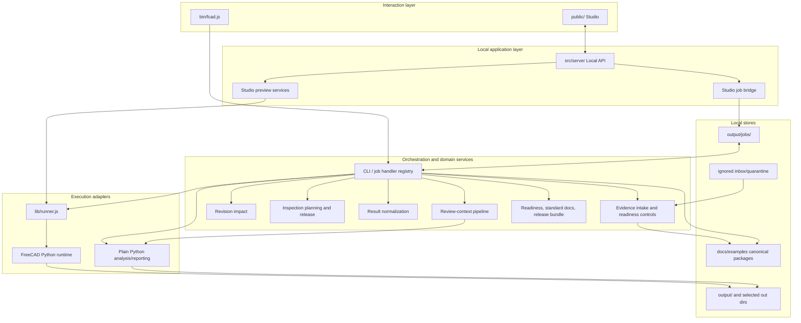
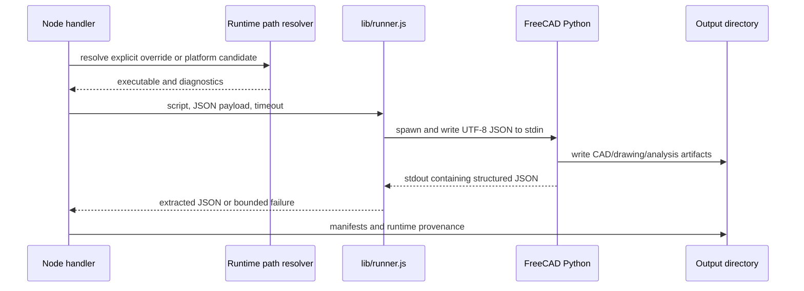
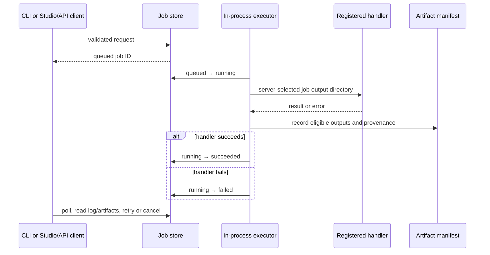
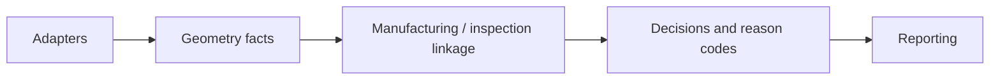

# Runtime and component architecture

[Back to architecture navigation](./README.md)

## Deployment unit

The product is a local modular monolith, not a collection of deployable services. `bin/fcad.js` is the unified command entry point. `fcad serve` hosts the static Studio and JSON API in the same Node process. Job execution is scheduled in-process, while Python and FreeCAD are child processes selected per command. The filesystem is the durable store.

Evidence:

- `bin/fcad.js`
- `src/server/local-api-server.js`
- `src/services/jobs/execution/handler-registry.js`
- `lib/runner.js`
- `src/orchestration/review-context-pipeline.js`

## Component responsibilities

| Component | Responsibility | Durable writes | Must not do |
| --- | --- | --- | --- |
| Command manifest | Machine-readable command names, lifecycle, runtime class, audience, surfaces, and safety boundaries | None | Execute commands or become a second dispatch table |
| CLI dispatcher | Parse arguments, validate command options, select handlers, report outputs | Command-selected output directory | Invent missing authority or bypass service contracts |
| Studio shell | Five workspaces: Console, Review, Packs, Model, Drawing; English/Korean UI | Browser-local UI state only | Become a canonical artifact store |
| Local API | Serve Studio, health, previews, job operations, registered artifact access | Through preview/job/domain services | Bind publicly or return unrestricted filesystem paths |
| Preview services | Short-lived config/model/drawing/import feedback | Temporary scratch directories | Claim persistence or canonical mutation |
| Studio job bridge | Translate supported UI submissions into tracked job requests | Job request through job store | Admit arbitrary command/path execution |
| Job store | Atomic request/state persistence, logs, retry/cancel metadata, artifact manifest | `request.json`, `job.json`, `job.log`, `artifact-manifest.json` | Treat a successful process as engineering approval |
| Job executor | Run registered handlers and finalize manifests/status | Job-owned output directory | Accept client-selected artifact destinations |
| Review-context pipeline | Ingest context, analyze part, link quality/manufacturing, build canonical review pack | Selected output directory | Label generated quality as physical evidence |
| Revision-impact service | Compare exact artifact identities and create deterministic change/reinspection planning | New report and derived plan outputs | Mutate baseline/candidate or attach evidence |
| Inspection-plan service | Create canonical full/delta plan and derived human-facing controls | New plan/checksheet/request/template | Create measurements or release itself |
| Plan-release service | Validate exact authorization and released bytes; write release record | Immutable release record | Approve product/readiness or create evidence |
| Result normalizer | Snapshot and reconcile one released-template CSV format | Normalization artifact in requested output | Promote, authorize, attach, supersede, or regenerate |
| Evidence onboarding | Classify, quarantine, validate, ledger, authorize, attach, and gate readiness regeneration | Ignored quarantine and narrowly allowlisted canonical files | Infer real provenance or combine human decisions |
| Readiness/release workflows | Compute review status and assemble declared outputs | Readiness, standard docs, release bundle | Publish, procure, or manufacture |

Evidence:

- `src/shared/command-manifest.js`
- `public/js/studio/studio-surfaces.js`
- `public/js/i18n/index.js`
- `src/services/jobs/job-store.js`
- `src/services/jobs/job-executor.js`
- `src/services/revision-impact/revision-impact-service.js`
- `src/services/inspection-plan/inspection-plan-service.js`
- `src/services/inspection-plan/inspection-plan-release-service.js`
- `src/services/inspection-result/inspection-result-normalization-service.js`

## Execution classes

The command manifest, not this prose, is the inventory source of truth. Architecturally, commands fall into three classes:

| Class | Representative commands | Runtime behavior | Continuation property |
| --- | --- | --- | --- |
| FreeCAD-backed | `create`, `draw`, `inspect`, `fem`, `tolerance`, `report` | Resolve and spawn a compatible FreeCAD runtime | Produce runtime fingerprint and output artifacts for later artifact-only work |
| Artifact-driven | `dfm`, `review`, readiness/pack, revision, inspection plan/result/evidence controls, standard documents | Node and/or plain Python over existing files | Can continue without FreeCAD if lineage and schemas validate |
| Mixed/conditional | `analyze-part`, `design`, `sweep` | May use live runtime or a metadata/artifact path depending on requested work | Must surface fallback confidence and never imply live geometry inspection when absent |

The guided stable product path is narrower than the complete maintainer surface. It includes runtime checking, core CAD generation/inspection, review-context and readiness/packaging, the local server, revision comparison, inspection planning/release, and result normalization. Maintainer evidence controls remain deliberate operational commands rather than casual workflow steps.

Evidence:

- `src/shared/command-manifest.js` — `COMMAND_MANIFEST`, `getCommandManifest`
- `tests/command-manifest.test.js`
- `docs/command-lifecycle.md`

## FreeCAD process boundary

Runtime resolution honors explicit environment overrides before platform discovery. The runner tolerates FreeCAD banners by extracting the structured JSON response, bounds execution time, and returns captured diagnostics. A runtime-backed claim is valid only when this boundary actually ran; metadata-only fallback must say so.

Evidence:

- `lib/paths.js`
- `lib/runner.js`
- `lib/runtime-diagnostics.js`
- `src/services/runtime/runtime-fingerprint-service.js`
- `tests/paths-runtime.test.js`

## Studio and Local API

The Local API defaults to port 3000 and explicitly listens on `127.0.0.1`. Its route families are:

- shell and operations: `/`, `/studio`, `/api`, `/health`;
- Studio scratch previews: config validation, design/model preview, import bootstrap, drawing preview, and drawing-dimension editing;
- job submission: Studio-constrained `/api/studio/jobs` and direct `/jobs`;
- job operations: status, retry, cancellation, artifact listing, viewing, and download;
- canonical-package discovery and size-capped artifact preview.

Scratch previews and tracked jobs have different semantics. Scratch services use temporary directories and bounded caches for interactive feedback. Tracked jobs use persistent job directories, explicit lifecycle state, logs, and an artifact manifest. A special constrained `review-context` handoff exists in `STUDIO_SUBMISSION_JOB_COMMANDS`; its absence from the generic Studio command list is intentional.

Evidence:

- `src/server/routes/local-api-studio-routes.js`
- `src/server/routes/local-api-job-routes.js`
- `src/server/routes/local-api-artifact-routes.js`
- `src/server/canonical-package-discovery.js`
- `src/server/studio-job-bridge.js`
- `tests/local-api.integration.test.js`

## Tracked-job execution

Queued cancellation is durable. Running cancellation depends on executor support and is not assumed by the base in-process executor. Retry is limited to failed/cancelled jobs whose input references remain available. The public AF execution contract normalizes the job store's persisted `cancelled` spelling to `canceled` for cross-surface consumers.

Evidence:

- `src/services/jobs/job-store.js`
- `src/services/jobs/job-executor.js`
- `lib/af-execution-contract.js`
- `tests/af-execution-jobs.test.js`

## Analysis layering

Plain Python analysis keeps a one-way dependency direction:

This direction prevents presentation concerns from becoming geometry truth and keeps heuristic decisions inspectable. Live geometry may enrich the chain; metadata fallback remains valid only when its lower confidence and missing evidence are explicit.

Evidence:

- `docs/architecture-v2.md`
- `scripts/adapters/`
- `scripts/geometry/`
- `scripts/linkage/`
- `scripts/decision/`
- `scripts/reporting/`

## Target runtime posture

No new process topology is required for the first production proof. Preserve the CLI, loopback server, in-process jobs, filesystem contracts, and child-process boundary. The target work is contract completion—revision lineage, exact external-decision references, genuine evidence intake, and proof indexing—not service decomposition. A remote API, queue, database, worker fleet, or user-account system would add authority and security problems without improving the evidentiary chain.
