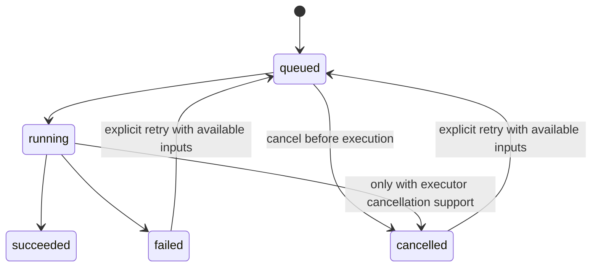
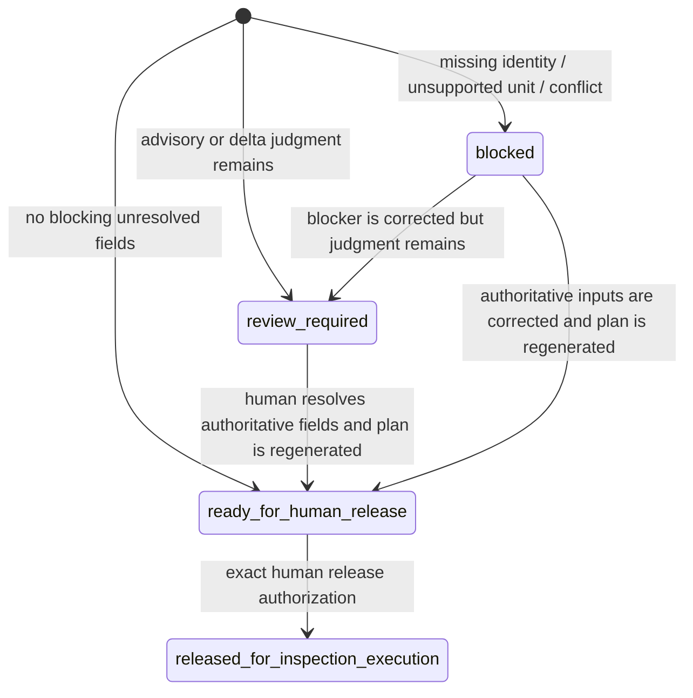
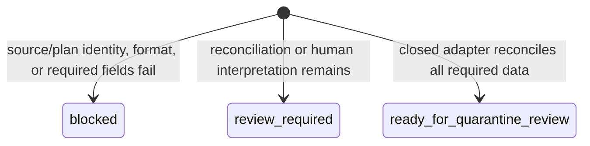
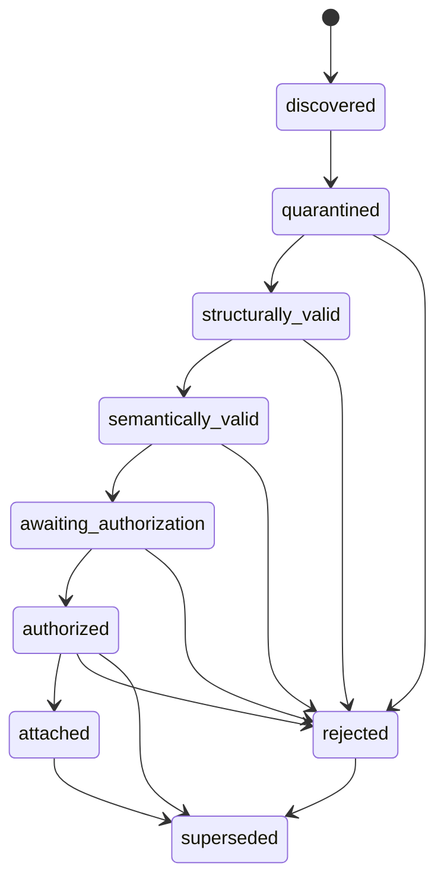
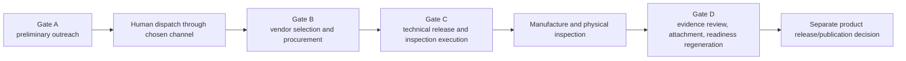
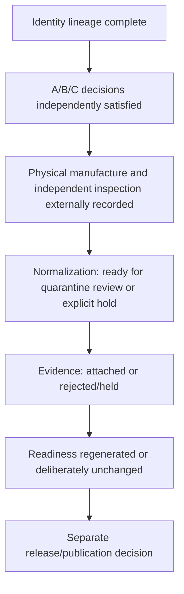

# State and authorization model

[Back to architecture navigation](./README.md)

## Why states remain separate

FreeCAD Automation has several independent state machines. They answer different questions and cannot safely be merged into a single “done,” “pass,” or “ready” value.

| State domain | Question answered | Does not answer |
| --- | --- | --- |
| Execution/job | Did a software operation run? | Was its engineering result correct or approved? |
| QA/check result | Did an automated rule pass? | Was a real part produced or inspected? |
| Readiness | What does the current artifact set support? | Has a human released or published the product? |
| Revision impact | What appears changed and what needs review/reinspection? | Is the new revision technically approved? |
| Inspection plan | Is the measurement plan complete enough for human release? | Has inspection occurred? |
| Plan release | Did a human release exact plan bytes for inspection execution? | Did the part pass or become production-ready? |
| Result normalization | Can submitted rows be reconciled with the released plan? | Are the source and provenance accepted as evidence? |
| Evidence onboarding | Where is a candidate in quarantine, review, authorization, and attachment? | Has readiness been regenerated or release approved? |
| Commercial/production | Was outreach, procurement, technical release, manufacture, or inspection performed? | Is the repository package updated? |
| Publication | Was an artifact approved for a delivery/public channel? | Is it inherently correct merely because it was published? |

## Software execution state

The job store persists British `cancelled`; the AF execution contract exposes canonical `canceled` after normalization. Clients must use the contract mapping rather than compare raw stored strings. A successful job means the registered handler completed and artifacts were recorded; it never implies QA, readiness, inspection, or release approval.

Evidence:

- `src/services/jobs/job-store.js`
- `lib/af-execution-contract.js`
- `tests/af-execution-jobs.test.js`

## Revision and inspection-plan state

Revision impact is a deterministic report with stable change IDs and explicit uncertainty. It is a planning input, not an approval state. The derived inspection plan then has one of three statuses:

`released_for_inspection_execution` is a separate immutable release-record state. Its schema fixes all adjacent claims to false: it is not inspection evidence, product release, readiness approval, evidence attachment, readiness regeneration, or a cryptographic signature.

Evidence:

- `src/services/revision-impact/revision-impact-service.js`
- `src/services/inspection-plan/inspection-plan-service.js`
- `src/services/inspection-plan/inspection-plan-release-service.js`
- `schemas/inspection-plan-release-record.schema.json`

## Result normalization state

This is a computed outcome of one normalization run, not a promotion lifecycle. Even `ready_for_quarantine_review` remains an untrusted candidate. The schema requires `inspection_evidence: false`, `authorization_created: false`, `evidence_attached: false`, `readiness_regenerated: false`, `canonical_artifacts_mutated: false`, and `human_review_required: true`.

Evidence:

- `src/services/inspection-result/inspection-result-normalization-service.js`
- `schemas/inspection_result_normalization.schema.json`
- `tests/inspection-result-normalization.test.js`

## Evidence onboarding lifecycle

The implementation supports the v1 forward intake and attachment path. `superseded` is represented in the contract, but there is no v1 supersession command; corrected bytes receive a new identity and start again. Rejected content cannot re-enter by being renamed. Generated/control, synthetic-fixture, and unsupported-format classes are rejected for genuine production use.

Important transitions have distinct authorities:

- classification and validation are software findings;
- human review must occur after semantic validation;
- attachment authorization binds exact candidate, onboarding ledger, package, revision, and current readiness context;
- attachment creates canonical files and an immutable receipt but does not alter readiness;
- readiness regeneration needs another authorization and an attachment-bound review-context artifact.

Evidence:

- `docs/inspection-evidence-contract.md`
- `schemas/inspection-evidence-onboarding-record.schema.json`
- `schemas/inspection-evidence-authorization.schema.json`
- `schemas/inspection-evidence-attachment-record.schema.json`
- `schemas/inspection-evidence-readiness-authorization.schema.json`

## Readiness and release state

Readiness is a derived assessment rather than a universal enumerated workflow. The canonical builder uses evidence and risk conditions to produce statuses and gate decisions such as:

- missing genuine inspection evidence → `needs_more_evidence` / `hold_for_evidence_completion`;
- sufficient review score and inputs → `candidate_for_pilot_line_review`;
- remaining risk or score deficit → `hold_before_line_commitment`.

These values remain recommendations for review. A candidate gate is not product release. Any publication/delivery decision remains a separate human action even when readiness improves. If attached evidence reports a failure or conflict, truthful regeneration may preserve or strengthen a hold; successful execution of the regeneration command must not force a favorable result.

Evidence:

- `src/workflows/canonical-readiness-builders.js` — `buildReadinessSummary`
- `schemas/readiness_report.schema.json`
- `tests/readiness-builders.test.js`
- `tests/readiness-inspection-evidence-contract.test.js`

## Human gates A–D

| Gate | Existing repository control | Decision retained outside/with humans | Cannot authorize |
| --- | --- | --- | --- |
| A — preliminary outreach | Standalone exact-byte authorization record; no `fcad` dispatch command | Sender account, recipient IDs, confidentiality, and non-binding outreach | Email/form dispatch, vendor selection, budget, purchase, technical release, evidence, publication |
| B — vendor/procurement | No procurement engine; Gate A explicitly defers it | Actual quotation comparison, provider selection, budget, tax/shipping/payment, commercial commitment | Engineering release, inspection, evidence, product release |
| C — technical/inspection release | Inspection plan authorization and immutable release record for exact plan/distributed files | Released tolerances/methods/material/finish/sampling, engineering and quality reviewers, manufacturing route | Product release, evidence acceptance, readiness approval |
| D — evidence/readiness | Onboarding ledger, attachment authorization/receipt, attachment-bound context, readiness authorization | Source authenticity, evidence acceptability, exception/disposition, readiness replacement | Procurement or retroactive manufacturing truth |

No gate record can be reused to satisfy another gate. Gate A deliberately records `dispatch_authorized: false`; an external human action is still needed even for preliminary outreach.

Evidence:

- `docs/preliminary-rfq-outreach-authorization.md`
- `schemas/preliminary-rfq-outreach-authorization.schema.json`
- `schemas/inspection-plan-release-authorization.schema.json`
- `schemas/inspection-plan-release-record.schema.json`
- `docs/inspection-evidence-contract.md`

## Authorization anatomy

A valid narrow authorization should answer all of the following:

1. Who made the decision and in which organizational role?
2. What exact operation is allowed?
3. Which package, part, and revision are in scope?
4. Which exact input and output bytes or ledger state are bound?
5. What purpose, recipient, channel, or external record is in scope?
6. What is explicitly not authorized?
7. When was the decision made, and does chronology follow the reviewed state?
8. Is the operation create-only, or is an exact replacement expected?
9. What immutable receipt proves that the authorized operation—not some broader one—occurred?

Schema validation alone cannot prove the signer had real authority. The operating organization remains responsible for identity and role verification.

## Production proof state chain

The target proof should be represented as linked state domains rather than a new global status:

The architectural proof is complete when every transition has honest evidence, including a fail/hold path. Production acceptance is a narrower favorable outcome and must never be substituted for the proof of a controlled process.
