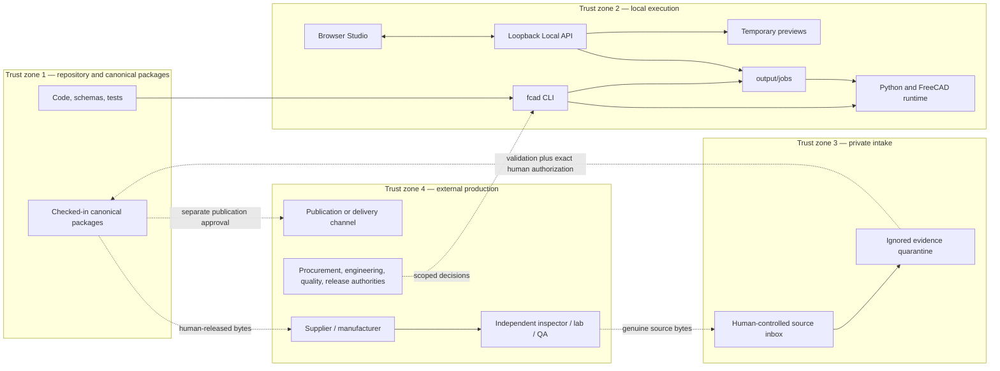

# System context and trust boundaries

[Back to architecture navigation](./README.md)

## Scope

FreeCAD Automation is a local decision-support and artifact-orchestration product embedded in a larger human production process. The product boundary includes repository code and contracts, the `fcad` process, its child Python/FreeCAD processes, the loopback Local API, the browser Studio, local job/output storage, and narrowly controlled canonical-package writes. It does not include supplier communications, commercial commitments, manufacturing equipment, physical measurement, organizational approval, or public release channels.

Evidence:

- `src/server/local-api-server.js`
- `src/services/jobs/job-store.js`
- `src/services/inspection-evidence-intake/inspection-evidence-onboarding-service.js`
- `docs/inspection-evidence-contract.md`
- `docs/preliminary-rfq-outreach-authorization.md`

## Actors and system relationships

| Actor or system | Inputs to the product | Outputs from the product | Boundary that remains outside software |
| --- | --- | --- | --- |
| CAD/design engineer | TOML config, CAD source, design intent, revision identity | FCStd/STEP/STL/BREP, drawing artifacts, model and drawing QA | Design approval and released design definition |
| Manufacturing engineer | Material/process assumptions and review context | DFM, process, line, quality, investment, and standard-document drafts | Process approval and shop-floor execution |
| Quality engineer | Inspection requirements, plan review, result review | Inspection plan, checksheet, normalized result, evidence controls | Method suitability, disposition, and evidence authorization |
| Maintainer/operator | Commands, runtime configuration, local paths, explicit authorization files | Jobs, diagnostics, manifests, audited canonical writes | Custody of the workstation, secrets, and controlled release |
| Browser | User intent over loopback HTTP | Redacted job/artifact views and downloads | It is not an authority or a durable system of record |
| FreeCAD runtime | Validated JSON request plus local source paths | Geometry, drawing, inspection, and runtime-backed output | It does not approve engineering correctness |
| Supplier/manufacturer | Human-released technical and commercial packet | Physical part and supplier records | Quote, contract, process execution, shipping, and authenticity |
| Inspector/lab/QA source | Released plan and physical part | Genuine, attributable measurement/result bytes | Measurement act and source-record custody |
| Procurement authority | RFQ packet, actual quotations, budget and terms | Provider and purchase decision | Financial and contractual commitment |
| Release authority | Exact artifact hashes, evidence state, readiness and exceptions | Scoped approval record or external decision reference | Product acceptance and publication decision |

Evidence:

- `src/shared/command-manifest.js` — command audience and safety-boundary metadata
- `docs/vision.md`
- `docs/product-workflows.md`
- `docs/inspection-plan-and-supplier-checksheet.md`
- `docs/inspection-result-adapters.md`

## Interfaces across boundaries

| Boundary | Interface now | Trust rule |
| --- | --- | --- |
| User → CLI | Command arguments and local files | CLI/schema validation; never infer missing identity or authorization |
| Studio → Local API | Same-origin JSON and registered artifact routes | Bind only to `127.0.0.1`; redact raw paths; serve only policy-eligible files |
| Node → Python/FreeCAD | UTF-8 JSON over stdin/stdout and local paths | Time-bound child process; structured response; runtime diagnostics preserved |
| Executor → job store | Atomic local JSON writes and append-only log | Server chooses job directory; state transitions are explicit |
| Existing artifact → re-entry | Review pack, readiness report, or release bundle | Validate schema, compatibility, lineage, and referenced bytes before use |
| External result → private intake | Exact source bytes plus declared provenance/metadata | Treat as untrusted; quarantine first; preserve source hash; no automatic promotion |
| Private intake → canonical package | Candidate envelope, immutable onboarding ledger, separate authorization | Create-only allowlisted writes; exact hashes and package/revision must match |
| Canonical package → external party | Human-selected and released bytes | A generated plan, pack, or Gate A record does not itself send or authorize anything |
| Canonical package → publication | Human-reviewed release package | Job success/readiness score cannot publish or release a product |

Evidence:

- `lib/runner.js`
- `lib/af-execution-contract.js`
- `src/server/routes/local-api-artifact-routes.js`
- `src/services/jobs/job-store.js`
- `schemas/inspection-evidence-authorization.schema.json`
- `schemas/inspection-evidence-attachment-record.schema.json`

## System A and System B handoff

System A may prepare bounded control artifacts and may record a human decision after it is supplied. System B owns the act. The relationship is intentionally asymmetric:

1. software generates or validates exact bytes;
2. a named human reviews those bytes for one narrow purpose;
3. the external act occurs through a human-controlled channel;
4. external source bytes return with provenance;
5. software preserves and checks the bytes but cannot attest that the claimed real-world act occurred;
6. another human reviews the returned evidence and decides whether it may be attached and later reflected in readiness.

The first genuine production proof therefore needs both systems. A purely local run can prove software behavior, but not manufacture or physical conformance. A physical part without controlled artifact lineage cannot prove that this repository's released intent was manufactured and inspected.

## Explicit non-capabilities

At the reference baseline, the product does not:

- dispatch email, contact forms, RFQs, purchase orders, or supplier files;
- select a vendor, approve cost, pay, ship, or schedule manufacturing;
- operate manufacturing or measurement equipment;
- turn a completed CSV into canonical inspection evidence without quarantine and human authorization;
- regenerate readiness as a side effect of evidence attachment;
- publish a release because a job, QA check, or readiness calculation succeeded;
- provide a hosted multi-user service, remote worker fleet, or distributed database.

These omissions are safety boundaries, not unfinished transport features.

Evidence:

- `schemas/preliminary-rfq-outreach-authorization.schema.json` — `dispatch_authorized: false`
- `schemas/inspection_result_normalization.schema.json` — boundary constants
- `schemas/inspection-evidence-attachment-record.schema.json` — `regenerated: false`
- `docs/ci-governance.md`

## Deployment and data residency

The supported product topology is one trusted workstation or controlled self-hosted runner. The browser and API are local peers on that machine; tracked jobs, generated outputs, private intake, and canonical repository data remain filesystem artifacts. CI exercises source and contract behavior on hosted runners and FreeCAD behavior only on a governed self-hosted macOS runner. CI artifacts are temporary diagnostics, not evidence or publication.

Target evolution preserves this topology through the first production proof. Any later multi-user or remote-execution design requires a separate threat model, identity model, authorization model, secrets model, retention policy, and architecture decision; it is not implied by this blueprint.

Evidence:

- `.github/workflows/automation-ci.yml`
- `.github/workflows/freecad-runtime-smoke.yml`
- `docs/self-hosted-runtime-governance.md`
- `docs/support-matrix.md`
