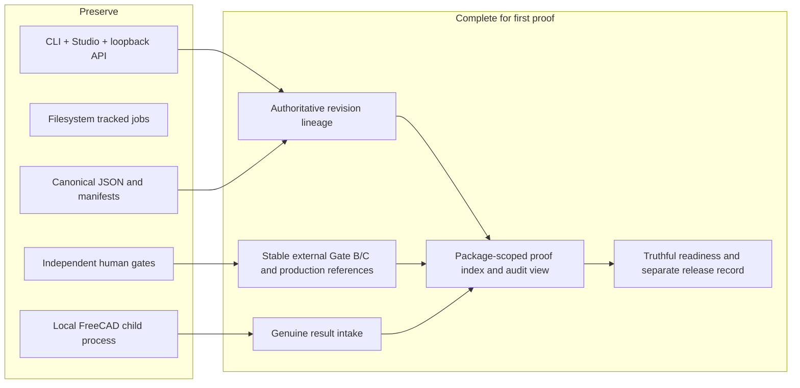

# Target architecture and roadmap

[Back to architecture navigation](./README.md)

## Target outcome

The target is one auditable production-proof chain, not a broader platform. The existing local modular monolith remains the product. Evolution adds missing identity, external-decision references, proof aggregation, and operational verification around the already-shipped inspection/evidence controls.

## Architectural principles for the target

1. Add contracts only where a missing contract prevents auditability; do not add transport or workflow engines for their own sake.
2. Preserve existing outputs, routes, runtime behavior, manifests, and human gates.
3. Make package/revision/hash identity explicit before any real-world handoff.
4. Keep external commercial and physical systems external; reference their records without impersonating them.
5. Accept genuine evidence only through the current quarantine → review → authorization → attachment → separate readiness path.
6. Treat a nonconformance and resulting hold as a valid production-proof outcome.
7. Use one part and one closed result adapter for the first proof; expand formats only from observed need.
8. No hosted control plane, microservices, database, remote queue, automated email, supplier portal, or procurement subsystem.

## Gap register at the reference baseline

| Gap | Baseline evidence | Risk | Required closure |
| --- | --- | --- | --- |
| G-01 Revision propagation | Canonical package configs contain revisions while review/readiness artifacts are `null` | Wrong-revision plan or evidence binding | Select one authoritative revision source and regenerate descendants with tested lineage |
| G-02 No genuine physical result | All canonical packages remain held; fixtures are synthetic | No proof of manufacture or inspection | Obtain one independent completed record from a real part |
| G-03 Gate B remains external/unindexed | Gate A schema explicitly defers procurement | Audit chain can lose provider/order identity | Store stable non-secret external decision/transaction references and exact package hash set |
| G-04 Technical release is narrower than full production release | Existing release record covers inspection execution only | Manufacturing bytes may diverge from inspected bytes | Human-controlled external technical release reference must bind the same revision/hash set |
| G-05 No single proof traversal artifact | Evidence graph and manifests cover product subsets | Reviewers must assemble chain manually | Add a read-only package-scoped proof index referencing existing and external records; no new authority |
| G-06 Supersession is represented but not executable | Evidence contract has `superseded`, no v1 command | Later correction path is manual | Not required for first proof; document hold/recovery, design only after real need |
| G-07 Publication remains an external decision | Local bundles exist, no publication event | A ZIP could be misdescribed as released | Record explicit external release/publication decision or explicit hold after readiness review |

Evidence:

- `docs/examples/*/config.toml`
- `docs/examples/*/review/review_pack.json`
- `docs/examples/*/readiness/readiness_report.json`
- `docs/project-closeout-status.md`
- `docs/preliminary-rfq-outreach-authorization.md`
- `docs/inspection-evidence-contract.md`

## Minimal target additions

### 1. Revision-lineage hardening

Make revision a first-class required value for the selected production-proof package and propagate it through review, readiness, revision impact, inspection plan, released files, normalization, evidence envelope, and attachment/readiness authorizations. Add contract tests that reject `null`, mismatched, or silently defaulted revisions in proof mode. Do not retroactively make revision mandatory for every legacy/demo workflow unless compatibility policy is explicitly changed.

### 2. External decision references

Do not build procurement or manufacturing modules. Define the minimum reference shape used by the proof index: gate, external system/custodian, stable record ID, decision time, actor/role reference, package/revision, bound artifact hashes, disposition, and optional confidential-location reference. The external record remains authoritative. Repository data must contain no secrets or invented quotation/inspection details.

### 3. Production-proof index

Add a read-only, additive canonical JSON index only after its fields are proven by the real pilot. It should reference—not copy or supersede—the existing config, manifests, runtime fingerprint, review/readiness, inspection plan release, normalization, evidence onboarding/authorization/receipt, and external gate records. It carries no approval field of its own. Its validation reports missing, mismatched, stale, or inaccessible links and derives a traversal status such as incomplete, review-required, or chain-complete.

### 4. Proof audit view

Expose the proof index through the existing CLI/artifact surface and, only if it materially helps reviewers, the existing Review or Packs workspace. Reuse registered artifact access, Korean/English locale, path redaction, and tracked jobs. Do not add a sixth product surface or remote service for the pilot.

### 5. Truthful closeout

After evidence attachment and separately authorized readiness regeneration, assemble standard documents and a release bundle through existing workflows. Record an external/human product release or publication decision separately. A chain-complete proof with failed inspection remains a documented hold; a favorable accepted-for-production claim additionally needs passing evidence and the relevant engineering/quality/release authorities.

## Delivery roadmap

### Phase 0 — Freeze the proof definition

Deliverables:

- choose one package/part and accountable design, quality, procurement, and release roles;
- document confidentiality, private-source retention, provider independence, and publication rules;
- record the baseline commit and exact supported workstation/runtime;
- agree that process proof can complete with a hold/nonconformance.

Exit criteria:

- named owners accept the system boundary and claim vocabulary;
- no outreach, purchase, manufacturing, or evidence mutation has begun;
- the proof has a bounded cost/part/quantity and stop conditions.

### Phase 1 — Repair authoritative identity

Deliverables:

- authoritative package slug, part number, and non-null revision;
- regenerated config descendants and updated hashes/manifests;
- tests for cross-artifact revision consistency and stale authorization rejection.

Exit criteria:

- review pack, readiness report, revision impact, inspection plan, and all external packets agree on identity;
- no proof-chain field relies on filename inference or `revision: null`.

### Phase 2 — Release an inspectable technical package

Deliverables:

- actual runtime fingerprint and generated/inspected CAD/drawing artifacts;
- resolved DFM/drawing/create-quality and review findings or explicit accepted holds;
- canonical full inspection plan, derived controls, exact hashes, engineering/quality review;
- immutable inspection-plan release record.

Exit criteria:

- plan status is `ready_for_human_release` before release;
- released model/drawing/specification and inspection bytes share one revision;
- release boundaries still state no product/readiness/evidence approval.

### Phase 3 — Execute Gates A–C outside the product

Deliverables:

- Gate A exact-byte authorization and separately performed dispatch;
- actual quote comparison/provider/procurement record under external authority;
- full technical release/manufacturing-order reference bound to the same hash set;
- recorded supplier/lot/quantity and inspection-provider independence.

Exit criteria:

- no software artifact claims it sent, selected, purchased, or manufactured;
- external IDs and custodians are stable and reviewable;
- commercial/private data copied into the repository is minimized.

### Phase 4 — Manufacture and collect genuine inspection

Deliverables:

- real physical part and manufacturing lot/shipping references;
- completed released-template result or a preserved unsupported native source;
- inspector/reviewer, method/equipment, timestamps, revision, and source provenance.

Exit criteria:

- a reviewer can distinguish supplier, inspector, and authorizing roles;
- original bytes are preserved before transformation;
- no fixture, blank template, generated QA, or CI output is offered as evidence.

### Phase 5 — Normalize, attach, and regenerate under Gate D

Deliverables:

- normalization with separate reported/computed outcomes;
- quarantine copy, candidate envelope, immutable onboarding ledger, and human review;
- exact attachment authorization, canonical evidence, immutable attachment receipt;
- proof that readiness remained unchanged at attachment;
- attachment-bound review context, separate readiness authorization, truthful replacement readiness.

Exit criteria:

- all schema, identity, chronology, and hash checks pass or the chain stops with an explicit hold;
- the canonical write is allowlisted and auditable;
- readiness outcome reflects the actual result rather than command success.

### Phase 6 — Index, audit, and close out

Deliverables:

- production-proof index built from observed pilot records;
- offline validation/audit report with every broken or external link visible;
- existing standard-doc/release-bundle output refreshed where appropriate;
- separate human release/publication decision or explicit hold;
- redacted architecture case study after confidentiality review.

Exit criteria:

- an independent reviewer can traverse the complete chain without oral context;
- source hashes, revisions, actors, gate scopes, and dispositions agree;
- publication status is explicit and cannot be inferred from file existence.

## Verification strategy for target changes

Each additive contract should have:

- schema positive/negative fixtures;
- adversarial identity, revision, hash, chronology, duplicate-key, path, and authority tests;
- output-safety tests proving no partial canonical writes;
- job/CLI parity where the command is exposed on both surfaces;
- no-evidence and synthetic-fixture rejection regression coverage;
- one dry-run rehearsal using synthetic bytes that proves controls but changes no canonical readiness;
- the one genuine pilot performed only after human gate approvals;
- read-only final audit of repository diff and external references.

Runtime smoke remains required only for claims that depend on FreeCAD. The proof-index validator should be artifact-driven and runnable offline.

## Deferred capabilities

Defer until after the first proof and a demonstrated need:

- additional supplier result formats or broad unit-conversion catalog;
- evidence supersession command;
- automated messaging or supplier portal;
- purchase/order/payment integration;
- remote job execution, shared database, authentication, or hosted deployment;
- digital signatures/PKI beyond current exact-hash records;
- automated publication;
- portfolio claims of official DELMIA or 3DEXPERIENCE integration.

Deferral protects the evidence chain from speculative surface area. Any later capability must preserve exact-byte authority, offline inspectability, legacy artifact compatibility, and truthful failure/hold behavior.

## Architecture exit criteria

The target architecture is reached for the first production proof when all are true:

1. the selected package has one authoritative non-null revision across every proof artifact;
2. required FreeCAD-backed work ran on a recorded compatible runtime;
3. Gates A, B, C, and D are separately evidenced by the appropriate human/external authorities;
4. a real part and genuine independent inspection source exist;
5. original source bytes, normalization, quarantine ledger, authorization, canonical evidence, and receipt are linked by exact hashes;
6. attachment did not mutate readiness, and later regeneration had its own authorization;
7. the final readiness/disposition is truthful even if it is a hold;
8. a separate release/publication decision or hold is recorded;
9. an independent reviewer can validate the chain offline, with external records explicitly identified;
10. no cloud/microservice, procurement, messaging, or automatic-release authority was introduced.

Evidence for completion must come from the future pilot artifacts and external records. This baseline repository supplies the software contracts and the plan, not the missing real-world proof.
